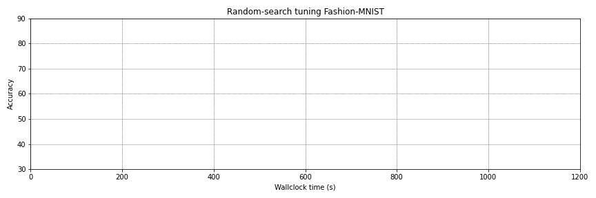

# Syne Tune: Large-Scale and Reproducible Hyperparameter Optimization

[](https://pypi.org/project/syne-tune/)
[](https://opensource.org/licenses/Apache-2.0)
[](https://pepy.tech/project/syne-tune)
[](https://syne-tune.readthedocs.io)
[](https://pypi.org/project/syne-tune/)
[](https://app.codecov.io/gh/awslabs/syne-tune)



[Documentation](https://syne-tune.readthedocs.io/en/latest/index.html)

This package provides state-of-the-art algorithms for hyperparameter optimization (HPO) with the following key features:
* Wide coverage (>20) of different HPO methods, including:
  * Asynchronous versions to maximize utilization and distributed versions (i.e., with multiple workers);
  * Multi-fidelity methods supporting model-based decisions (BOHB and MOBSTER);
  * Hyperparameter transfer learning to speed up (repeated) tuning jobs;
  * Multi-objective optimizers that can tune multiple objectives simultaneously (such as accuracy and latency).
* HPO can be run in different environments (locally, AWS, simulation) by changing just one line of code.
* Out-of-the-box tabulated benchmarks that allows you simulate results in seconds while preserving the real dynamics of asynchronous or synchronous HPO with any number of workers.

## Installing

To install Syne Tune from pip, you can simply do:

```bash
pip install 'syne-tune[extra]'
```

or to install the latest version from source (necessary to run the scripts in the [examples/](https://github.com/awslabs/syne-tune/tree/main/examples) folder): 

```bash
git clone https://github.com/awslabs/syne-tune.git
cd syne-tune
python3 -m venv st_venv
. st_venv/bin/activate
pip install wheel
pip install --upgrade pip
pip install -e '.[extra]'
```

This installs everything in a virtual environment `st_venv`. Remember to activate
this environment before working with Syne Tune. We also recommend building the
virtual environment from scratch now and then, in particular when you pull a new
release, as dependencies may have changed.

See our [change log](CHANGELOG.md) to see what changed in the latest version. 

## Getting started

To enable tuning, you have to report metrics from a training script so that they can be communicated later to Syne Tune,
this can be accomplished by just calling `report(epoch=epoch, loss=loss)` as shown in the example below:

```python
# train_height_simple.py
import logging
import time

from syne_tune import Reporter
from argparse import ArgumentParser

if __name__ == '__main__':
    root = logging.getLogger()
    root.setLevel(logging.INFO)
    parser = ArgumentParser()
    parser.add_argument('--steps', type=int)
    parser.add_argument('--width', type=float)
    parser.add_argument('--height', type=float)
    args, _ = parser.parse_known_args()
    report = Reporter()
    for step in range(args.steps):
        time.sleep(0.1)
        dummy_score = 1.0 / (0.1 + args.width * step / 100) + args.height * 0.1
        # Feed the score back to Syne Tune.
        report(epoch=step + 1, mean_loss=dummy_score)
```

Once you have a script reporting metric, you can launch a tuning as-follow:

```python
# launch_height_simple.py
from syne_tune import Tuner, StoppingCriterion
from syne_tune.backend import LocalBackend
from syne_tune.config_space import randint
from syne_tune.optimizer.baselines import ASHA

# hyperparameter search space to consider
config_space = {
    'width': randint(1, 20),
    'height': randint(1, 20),
    'epochs': 100,
}

tuner = Tuner(
    trial_backend=LocalBackend(entry_point='train_height.py'),
    scheduler=ASHA(
        config_space,
        metric='mean_loss',
        resource_attr='epoch',
        max_resource_attr="epochs",
        search_options={'debug_log': False},
    ),
    stop_criterion=StoppingCriterion(max_wallclock_time=30),
    n_workers=4,  # how many trials are evaluated in parallel
)
tuner.run()
```

The above example runs ASHA with 4 asynchronous workers on a local machine.

## Supported HPO methods

The following hyperparameter optimization (HPO) methods are available in Syne Tune:

Method | Reference | Searcher | Asynchronous? | Multi-fidelity? | Transfer? 
:--- | :---: | :---: | :---: | :---: | :---: 
Grid Search |  | deterministic | yes | no | no 
Random Search | Bergstra, et al. (2011) | random | yes | no | no 
Bayesian Optimization | Snoek, et al. (2012) | model-based | yes | no | no 
BORE | Tiao, et al. (2021) | model-based | yes | no | no 
MedianStoppingRule | Golovin, et al. (2017) | any | yes | yes | no 
SyncHyperband | Li, et al. (2018) | random | no | yes | no 
SyncBOHB | Falkner, et al. (2018) | model-based | no | yes | no 
SyncMOBSTER | Klein, et al. (2020) | model-based | no | yes | no 
ASHA | Li, et al. (2019) | random | yes | yes | no 
BOHB | Falkner, et al. (2018) | model-based | yes | yes | no 
MOBSTER | Klein, et al. (2020) | model-based | yes | yes | no 
DEHB | Awad, et al. (2021) | evolutionary | no | yes | no 
HyperTune | Li, et al. (2022) | model-based | yes | yes | no
DyHPO | Wistuba, et al. (2022) | model-based | yes | yes | no
ASHABORE | Tiao, et al. (2021) | model-based | yes | yes | no 
PASHA | Bohdal, et al. (2022)| random or model-based | yes | yes | no 
REA | Real, et al. (2019) | evolutionary | yes | no | no 
KDE | Falkner, et al. (2018) | model-based | yes | no | no 
PBT | Jaderberg, et al. (2017) | evolutionary | no | yes | no 
ZeroShotTransfer | Wistuba, et al. (2015) | deterministic | yes | no | yes 
ASHA-CTS | Salinas, et al. (2021)| random | yes | yes | yes 
RUSH | Zappella, et al. (2021)| random | yes | yes | yes 
BoundingBox | Perrone, et al. (2019) | any | yes | yes | yes

The searchers fall into four broad categories, **deterministic**, **random**, **evolutionary** and **model-based**. The random searchers sample candidate hyperparameter configurations uniformly at random, while the model-based searchers sample them non-uniformly at random, according to a model (e.g., Gaussian process, density ration estimator, etc.) and an acquisition function. The evolutionary searchers make use of an evolutionary algorithm.

Syne Tune also supports [BoTorch](https://github.com/awslabs/syne-tune/blob/main/syne_tune/optimizer/schedulers/searchers/botorch/botorch_searcher.py) searchers.

## Supported multi-objective optimization methods

Method | Reference | Searcher | Asynchronous? | Multi-fidelity? | Transfer?
:--- | :---: | :---: | :---: | :---: | :---: 
Constrained Bayesian Optimization | Gardner, et al. (2014) | model-based | yes | no | no
MOASHA | Schmucker, et al. (2021) | random | yes | yes | no

HPO methods listed can be used in a multi-objective setting by scalarization or non-dominated sorting. See [multiobjective_priority.py](syne_tune/optimizers/schedulers/multiobjective/multiobjective_priority.py) for details.

## Examples

You will find many examples in the [examples/](examples/) folder illustrating
different functionalities provided by Syne Tune. For example:
* [launch_height_baselines.py](examples/launch_height_baselines.py):
  launches HPO locally, tuning a simple script 
  [train_height_example.py](examples/training_scripts/height_example/train_height.py) for several baselines  
* [launch_height_moasha.py](examples/launch_height_moasha.py):
  shows how to tune a script reporting multiple-objectives with multiobjective Asynchronous Hyperband (MOASHA)
* [launch_height_standalone_scheduler.py](examples/launch_height_standalone_scheduler.py):
  launches HPO locally with a custom scheduler that cuts any trial that is not
  in the top 80%
* [launch_height_sagemaker_remotely.py](examples/launch_height_sagemaker_remotely.py):
  launches the HPO loop on SageMaker rather than a local machine, trial can be executed either
  the remote machine or distributed again as separate SageMaker training jobs. See 
  [launch_height_sagemaker_remote_launcher.py](examples/launch_height_sagemaker_remote_launcher.py)
  for remote launching with the help of RemoteTuner also discussed in one of the FAQs.
* [launch_height_sagemaker.py](examples/launch_height_sagemaker.py):
  launches HPO on SageMaker to tune a SageMaker Pytorch estimator
* [launch_bayesopt_constrained.py](examples/launch_bayesopt_constrained.py):
  launches Bayesian contrained hyperparameter optimization
* [launch_height_sagemaker_custom_image.py](examples/launch_height_sagemaker_custom_image.py):
  launches HPO on SageMaker to tune a entry point with a custom docker image
* [launch_plot_results.py](examples/launch_plot_results.py): shows how to plot
  results of a HPO experiment
* [launch_tensorboard_example.py](examples/launch_tensorboard_example.py):
  shows how results can be visualized on the fly with TensorBoard
* [launch_nasbench201_simulated.py](examples/launch_nasbench201_simulated.py):
  demonstrates simulation of experiments on a tabulated benchmark
* [launch_fashionmnist.py](examples/launch_fashionmnist.py):
  launches HPO locally tuning a multi-layer perceptron on Fashion MNIST. This
  employs an easy-to-use benchmark convention
* [launch_huggingface_classification.py](examples/launch_huggingface_classification.py):
  launches HPO on SageMaker to tune a SageMaker Hugging Face estimator for sentiment classification
* [launch_tuning_gluonts.py](examples/launch_tuning_gluonts.py):
  launches HPO locally to tune a gluon-ts time series forecasting algorithm
* [launch_rl_tuning.py](examples/launch_rl_tuning.py):
  launches HPO locally to tune a RL algorithm on the cartpole environment
* [launch_height_ray.py](examples/launch_height_ray.py):
  launches HPO locally with [Ray Tune](https://docs.ray.io/en/master/tune/index.html)
  scheduler

## FAQ and Tutorials

You can check our [FAQ](https://syne-tune.readthedocs.io/en/latest/faq.html), to
learn more about Syne Tune functionalities.

* [Why should I use Syne Tune?](https://syne-tune.readthedocs.io/en/latest/faq.html#why-should-i-use-syne-tune)
* [What are the different installations options supported?](https://syne-tune.readthedocs.io/en/latest/faq.html#what-are-the-different-installations-options-supported)
* [How can I run on AWS and SageMaker?](https://syne-tune.readthedocs.io/en/latest/faq.html#how-can-i-run-on-aws-and-sagemaker)
* [What are the metrics reported by default when calling the `Reporter`?](https://syne-tune.readthedocs.io/en/latest/faq.html#what-are-the-metrics-reported-by-default-when-calling-the-reporter)
* [How can I utilize multiple GPUs?](https://syne-tune.readthedocs.io/en/latest/faq.html#how-can-i-utilize-multiple-gpus)
* [What is the default mode when performing optimization?](https://syne-tune.readthedocs.io/en/latest/faq.html#what-is-the-default-mode-when-performing-optimization)
* [How are trials evaluated on a local machine?](https://syne-tune.readthedocs.io/en/latest/faq.html#how-are-trials-evaluated-on-a-local-machine)
* [Where can I find the output of the tuning?](https://syne-tune.readthedocs.io/en/latest/faq.html#where-can-i-find-the-output-of-the-tuning)
* [How can I change the default output folder where tuning results are stored?](https://syne-tune.readthedocs.io/en/latest/faq.html#how-can-i-change-the-default-output-folder-where-tuning-results-are-stored)
* [What does the output of the tuning contain?](https://syne-tune.readthedocs.io/en/latest/faq.html#what-does-the-output-of-the-tuning-contain)
* [How can I enable trial checkpointing?](https://syne-tune.readthedocs.io/en/latest/faq.html#how-can-i-enable-trial-checkpointing)
* [How can I retrieve the best checkpoint obtained after tuning?](https://syne-tune.readthedocs.io/en/latest/faq.html#how-can-i-retrieve-the-best-checkpoint-obtained-after-tuning)
* [Which schedulers make use of checkpointing?](https://syne-tune.readthedocs.io/en/latest/faq.html#which-schedulers-make-use-of-checkpointing)
* [Is the tuner checkpointed?](https://syne-tune.readthedocs.io/en/latest/faq.html#is-the-tuner-checkpointed)
* [Where can I find the output of my trials?](https://syne-tune.readthedocs.io/en/latest/faq.html#where-can-i-find-the-output-of-my-trials)
* [How can I plot the results of a tuning?](https://syne-tune.readthedocs.io/en/latest/faq.html#how-can-i-plot-the-results-of-a-tuning)
* [How can I specify additional tuning metadata?](https://syne-tune.readthedocs.io/en/latest/faq.html#how-can-i-specify-additional-tuning-metadata)
* [How do I append additional information to the results which are stored?](https://syne-tune.readthedocs.io/en/latest/faq.html#how-do-i-append-additional-information-to-the-results-which-are-stored) 
* [I don’t want to wait, how can I launch the tuning on a remote machine?](https://syne-tune.readthedocs.io/en/latest/faq.html#i-dont-want-to-wait-how-can-i-launch-the-tuning-on-a-remote-machine)
* [How can I run many experiments in parallel?](https://syne-tune.readthedocs.io/en/latest/faq.html#how-can-i-run-many-experiments-in-parallel)
* [How can I access results after tuning remotely?](https://syne-tune.readthedocs.io/en/latest/faq.html#how-can-i-access-results-after-tuning-remotely)
* [How can I specify dependencies to remote launcher or when using the SageMaker backend?](https://syne-tune.readthedocs.io/en/latest/faq.html#how-can-i-specify-dependencies-to-remote-launcher-or-when-using-the-sagemaker-backend)
* [How can I benchmark different methods?](https://syne-tune.readthedocs.io/en/latest/faq.html#how-can-i-benchmark-different-methods)
* [What different schedulers do you support? What are the main differences between them?](https://syne-tune.readthedocs.io/en/latest/faq.html#what-different-schedulers-do-you-support-what-are-the-main-differences-between-them)
* [How do I define the search space?](https://syne-tune.readthedocs.io/en/latest/faq.html#how-do-i-define-the-search-space) 
* [How do I set arguments of multi-fidelity schedulers?](https://syne-tune.readthedocs.io/en/latest/faq.html#how-do-i-set-arguments-of-multi-fidelity-schedulers)
* [How can I visualize the progress of my tuning experiment with Tensorboard?](https://syne-tune.readthedocs.io/en/latest/faq.html#how-can-i-visualize-the-progress-of-my-tuning-experiment-with-tensorboard)
* [How can I add a new scheduler?](https://syne-tune.readthedocs.io/en/latest/faq.html#how-can-i-add-a-new-scheduler)
* [How can I add a new tabular or surrogate benchmark?](https://syne-tune.readthedocs.io/en/latest/faq.html#how-can-i-add-a-new-tabular-or-surrogate-benchmark)
* [How can I reduce delays in starting trials with the SageMaker backend?](https://syne-tune.readthedocs.io/en/latest/faq.html#how-can-i-reduce-delays-in-starting-trials-with-the-sageMaker-backend)
* [How can I pass lists or dictionaries to the training script?](https://syne-tune.readthedocs.io/en/latest/faq.html#how-can-i-pass-lists-or-dictionaries-to-the-training-script)
* [How can I write extra results for an experiment?](https://syne-tune.readthedocs.io/en/latest/faq.html#how-can-i-write-extra-results-for-an-experiment)

Do you want to know more? Here are a number of tutorials.
* [Basics of Syne Tune](https://syne-tune.readthedocs.io/en/latest/tutorials/basics/README.html)
* [Choosing a Configuration Space](https://syne-tune.readthedocs.io/en/latest/search_space.html)
* [Using the Built-in Schedulers](https://syne-tune.readthedocs.io/en/latest/schedulers.html)
* [Multi-Fidelity Hyperparameter Optimization](https://syne-tune.readthedocs.io/en/latest/tutorials/multifidelity/README.html)
* [Benchmarking in Syne Tune](https://syne-tune.readthedocs.io/en/latest/tutorials/benchmarking/README.html)
* [How to Contribute a New Scheduler](https://syne-tune.readthedocs.io/en/latest/tutorials/developer/README.html)
* [PASHA: Efficient HPO and NAS with Progressive Resource Allocation](https://syne-tune.readthedocs.io/en/latest/tutorials/pasha/pasha.html)
* [Using Syne Tune for Transfer Learning](https://syne-tune.readthedocs.io/en/latest/tutorials/transfer_learning/transfer_learning.html)


## Blog Posts

- [Run distributed hyperparameter and neural architecture tuning jobs with Syne Tune](https://aws.amazon.com/blogs/machine-learning/run-distributed-hyperparameter-and-neural-architecture-tuning-jobs-with-syne-tune/)
- [Hyperparameter optimization for fine-tuning pre-trained transformer models from Hugging Face](https://aws.amazon.com/blogs/machine-learning/hyperparameter-optimization-for-fine-tuning-pre-trained-transformer-models-from-hugging-face/) [(notebook)](https://github.com/awslabs/syne-tune/blob/hf_blog_post/hf_blog_post/example_syne_tune_for_hf.ipynb)
- [Learn Amazon Simple Storage Service transfer configuration with Syne Tune](https://aws.amazon.com/blogs/opensource/learn-amazon-simple-storage-service-transfer-configuration-with-syne-tune/) [(code)](https://github.com/aws-samples/syne-tune-s3-transfer)

## Security

See [CONTRIBUTING](CONTRIBUTING.md#security-issue-notifications) for more information.

## Citing Syne Tune

If you use Syne Tune in a scientific publication, please cite the following paper:

["Syne Tune: A Library for Large Scale Hyperparameter Tuning and Reproducible Research"](https://openreview.net/forum?id=BVeGJ-THIg9&referrer=%5BAuthor%20Console%5D(%2Fgroup%3Fid%3Dautoml.cc%2FAutoML%2F2022%2FTrack%2FMain%2FAuthors%23your-submissions)) First Conference on Automated Machine Learning, 2022.


```bibtex
@inproceedings{
  salinas2022syne,
  title={Syne Tune: A Library for Large Scale Hyperparameter Tuning and Reproducible Research},
  author={David Salinas and Matthias Seeger and Aaron Klein and Valerio Perrone and Martin Wistuba and Cedric Archambeau},
  booktitle={International Conference on Automated Machine Learning, AutoML 2022},
  year={2022},
  url={https://proceedings.mlr.press/v188/salinas22a.html}
}
```

## License

This project is licensed under the Apache-2.0 License.

