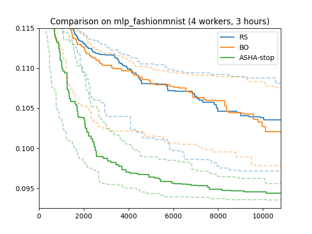

Asynchronous Successive Halving and Hyperband
=============================================

Early Stopping
--------------

.. |Learning Curves| image:: img/samples_lc.png

+------------------------------------------+
| |Learning Curves|                        |
+==========================================+
| Learning Curves (image from Aaron Klein) |
+------------------------------------------+

In the methods discussed above, we train each model for 81 epochs before
scoring it. This is expensive, it can take up to 1.5 hours. In order to figure
out whether a configuration is pretty poor, do we really need to train it all
the way to the end?

At least for most neural network training problems, the validation error after
training only a few epoch can be a surprisingly strong signal separating the
best from the worst configurations (see figure above). Therefore, if a certain
trial shows worse performance after (say) 3 epochs than many others, we may
just as well stop it early, allowing the worker to pick up another potentially
more rewarding task.

Synchronous Successive Halving and Hyperband
--------------------------------------------

*Successive halving* is a simple, yet powerful scheduling method based on the
idea of early stopping. Applied to our running example, we would start 81
trials with different, randomly chosen configurations. Computing validation
errors after 1 epoch, we stop the 54 (or 2/3) worst performing trials, allowing
the 27 (or 1/3) best performing trials to continue. This procedure is repeated
after 3, 9, and 27 epochs, each time the 2/3 worst performing trials are
stopped. This way, only a single trial runs all the way to 81 epochs. Its
configuration has survived stopping decisions after 1, 3, 9, and 27 epochs, so
likely is worth its running time.

In practice, concurrent execution has to be mapped to a small number of
workers, and successive halving is implemented by pausing trials at *rung
levels* (i.e., after 1, 3, 9, 27 epochs), and then resuming the top 1/3 to
continue training until the next rung level. Pause and resume scheduling is
implemented by *checkpointing*. We will ignore these details for now, but come
back to them later. Ignoring practical details of scheduling, and assuming that
training time per epoch is the same for each trial, the idea behind successive
halving is to spend the same amount of time on trials stopped after 1, 3, 9,
and 27 epochs, while making sure that at each rung level, the 2/3 worst
performers are eliminated.

Successive halving has two parameters: the reduction factor (3 in our example),
and the grace period (1 in our example). For a reduction factor 2, rung levels
would be 1, 2, 4, 8, 16, 32, 64, and we would eliminate the 1/2 worst
performers at each of them. The larger the reduction factor, the fewer rung
levels, and the more aggressive the filtering at each of them. The default
value in Syne Tune is 3, which seems to work well for most neural network
tuning problems. The grace period is the lowest rung level. Its choice is more
delicate. If set too large, the potential advantage of early stopping is lost,
since even the worst trials are trained for this many epochs. If set too small,
the validation errors at the lowest rung level are determined more by the
random initial weights than the training data, and stopping decisions there
will be arbitrary.

*Hyperband*, a generalization of successive halving, eliminates the grace
period as free parameter. In our example above, rung levels were
``[1, 3, 9, 27, 81]``, and the grace period was 1. Hyperband defines
*brackets* as sub-sequences starting at 1, 3, 9, 27, 81, of size 5, 4, 3, 2, 1
respectively. Then, successive halving is run on each of these brackets in
sequence, where the number of trials started for each bracket is adjusted in
a way that roughly equalizes the total number of epochs trained in each bracket.

While successive halving and Hyperband are widely known, they do not work all
that well for hyperparameter tuning of neural network models. The main reason
for this is their *synchronous* nature of decision-making. If we think of rungs
as lists of slots, which are filled by metric results of trials getting there,
each rung has an a priori fixed size. In our successive halving example, rungs
at ``r = 1, 3, 9, 27, 81`` epochs have sizes ``81 / r``. Each rung is a
*synchronization point*. Before *any* trial can be resumed towards level 3, all
81 trials have to complete their first epoch. The progress of well-performing
trials is delayed, not only because workers are idle due to some trials
finishing faster than others, but also because of sequential computations (we
rarely have 81 workers available). At the other extreme, filling the final
rung requires a single trial to train for 54 epochs, while all other workers
are idle. This can be compensated to some extent by free workers running
trials for the next iteration already, but scheduling becomes rather complex at
this point. Syne Tune provides synchronous Hyperband as
:class:`~syne_tune.optimizer.schedulers.synchronous.SynchronousHyperbandScheduler`.
However, we can usually do much better with asynchronous scheduling.

Asynchronous Successive Halving
-------------------------------

An asynchronous scheduler needs to be free of synchronization points. Whenever
a worker becomes available, the decision what it should do next must be
instantaneous, based on the data available at that point in time. It is not
hard to come up with an asynchronous variant successive halving. In fact, it
can be done in several ways.

Returning to our example, we pre-define a system of rungs at ``1, 3, 9, 27``
epochs as before, and we record metric values of trials reaching each rung.
However, instead of having fixed sizes up front, each rung is a growing list.
Whenever a trial reaches a rung (by having trained as many epochs as the rung
specifies), its metric value is entered into the sorted list. We can now
compute a predicate ``continue`` which is true iff the new value lies in the
top 1/3.

There are two variants of *asynchronous successive halving (ASHA)*, with
different requirements on the backend. In the *stopping* variant, a trial
reaching a rung level is stopped and discarded if ``continue = False``,
otherwise it is allowed to continue. If there is not enough data at a rung, the
trial continues by default. The backend needs to be able to stop jobs at
random times.

In the *promotion* variant, a trial reaching a rung level is always paused,
its worker is released. Once a worker becomes available, all rungs are scanned
top down. If any paused trial with ``continue = True`` is found, it is resumed
to train until the next rung level (e.g., a trial resumed at rung 3 trains
until 9 epochs): the trial is *promoted* to the next rung. If no paused trial
can be promoted, a new one is started from scratch. This ASHA variant requires
pause and resume scheduling. In particular, a trial needs to checkpoint its
state (at least at rung levels), and these checkpoints need to be accessible
to all workers. On the other hand, the backend never needs to stop running
trials, as the stopping condition for each training job is determined up
front.

Scripts for Asynchronous Successive Halving
-------------------------------------------

In this section, we will focus on the *stopping* variant of ASHA, leaving
the promotion variant for later. First, we need to modify our training
script. In order to support early stopping decisions, it needs to compute and
report validation errors during training. Recall
`traincode_report_end.py <basics_setup.html#annotating-the-training-script>`__
used with random search and Bayesian optimization. We will replace
``objective`` with the following code snippet, giving rise to
``traincode_report_eachepoch.py``:

.. literalinclude:: code/traincode_report_eachepoch.py
   :caption: traincode_report_eachepoch.py (relevant part)
   :start-at: def objective(config):
   :end-before: if __name__ == "__main__":

Instead of computing and reporting the validation error only after
``config['epochs']`` epochs, we do this at the end of each epoch. To
distinguish different reports, we also include ``epoch=epoch`` in each report.
Here, ``epoch`` is called *resource attribute*. For Syne Tune’s asynchronous
Hyperband and related schedulers, resource attributes must have positive
integer values, which you can think of “resources spent”. For neural network
training, the resource attribute is typically “epochs trained”.

This is the only modification we need. Curious readers may wonder why we
report validation accuracy after every epoch, while ASHA really only needs to
know it at rung levels. Indeed, with some extra effort, we could rewrite the
script to compute and report validation metrics only at rung levels, and ASHA
would work just the same. However, for most setups, training for an epoch is
substantially more expensive than computing the validation error at the end,
and we can keep our script simple. Moreover, Syne Tune provides some advanced
model-based extensions of ASHA scheduling, which make good use of metric data
reported at the end of every epoch.

Our `launcher script <basics_randomsearch.html#launcher-script-for-random-search>`__
runs stopping-based ASHA with the argument ``--method ASHA-STOP``. Note that
the entry point is ``traincode_report_eachepoch.py`` in this case, and the
scheduler is ``ASHA``. Also, we need to pass the name of the resource attribute
in ``resource_attr``. Finally, ``mode="stopping"`` selects the stopping
variant. Further details about ASHA and relevant additional arguments (for
which we use defaults here) are found in
`this tutorial <../multifidelity/README.html>`__.

When you run this script, you will note that many more trials are started than
for random search, and that the majority of trials are stopped after 1 or 3
epochs.

Results for Asynchronous Successive Halving
-------------------------------------------

+-----------------------------------------------+
| |Results for Asynchronous Successive Halving| |
+===============================================+
| Results for Asynchronous Successive Halving   |
+-----------------------------------------------+

Here are results for our running example (4 workers; 3 hours; median, 25/75
percentiles over 50 repeats). ASHA stopping makes a big difference,
outperforming random search and Bayesian optimization substantially. Early
stopping can speed up neural network tuning dramatically, compared to standard
scheduling.

If we ran for much longer, Bayesian optimization would eventually catch up
with ASHA and even do better. But of course, wall-clock time matters: it is an
important, if not the most important metric for automated tuning. The faster
satisfying results are obtained, the more manual iterations over data, model
types, and high level features can be afforded.
