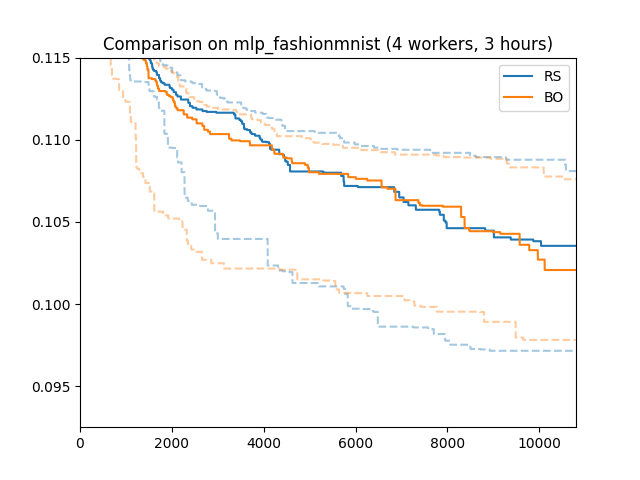

Bayesian Optimization
=====================

Sequential Model-Based Search
-----------------------------

With limited parallel computing resources, experiments are sequential
processes, where trials are started and report results in some ordering. This
means that when deciding on which configuration to explore with any given
trial, we can make use of all metric results reported by earlier trials, given
that they already finished. In the simplest case, with a single worker, a new
trial can start only once all earlier trials finished. We should be able to use
this information in order to make better and better decisions as the experiment
proceeds.

To make this precise, at any given time when a worker comes available, we need
to make a decision which configuration to evaluate with the new trial, based on
(a) which decisions have been made for all earlier trials, and (b) metric
values reported those earlier trials which have already finished. With more
than one worker, the trial set for (a) can be larger than for (b), since some
trials may still be running: their results are *pending*. It is important to
take pending trials into account, since otherwise we risk querying our
objective at redundant configurations. The best way to take information (a)
and (b) into account is by way of a statistical model, leading to *sequential
model-based* decision-making.

What is the challenge for making good *next configuration* decisions? Say we
have already evaluated the objective at a number of configurations, chosen at
random. One idea is to refine the search nearby the configuration which
resulted in the best metric value so far, thereby *exploiting* our knowledge.
Even without gradients, such local search can be highly effective. On the other
hand, it risks getting stuck in a local optimum. Another extreme is random
search, where we *explore* the objective all over the search space. Choosing
between these two extremes, at any given point in time, is known as
*explore-exploit trade-off*, and is fundamental to sequential model-based
search.

What is Bayesian Optimization?
------------------------------

One of the oldest and most widely used instantiations of sequential model-based
search is *Bayesian optimization*. There are a number of great tutorials and
review articles on Bayesian optimization, and we won’t repeat them here:

* `Slides by Ryan Adams <https://www.cs.toronto.edu/~rgrosse/courses/csc411_f18/tutorials/tut8_adams_slides.pdf>`__
* `Review by Peter Frazier <https://arxiv.org/abs/1807.02811>`__
* `Video by Peter Frazier <https://www.youtube.com/watch?v=c4KKvyWW_Xk>`__
* `Video by Nando de Freitas <https://www.youtube.com/watch?v=vz3D36VXefI>`__
* `Video by Matthew Hoffman <https://www.youtube.com/watch?v=C5nqEHpdyoE>`__

Most instances of Bayesian optimization work by modelling the objective as
function :math:`f(\mathbf{x})`, where :math:`\mathbf{x}` is a configuration
from the search space. Given such a *probabilistic surrogate model*, we can
condition it on the observed metric data (b) in order to obtain a posterior
distribution. Finally, we use this posterior distribution along with additional
statistics obtained from the data (such as for example the best metric value
attained so far) in order to compute a *acquisition function*
:math:`a(\mathbf{x})`, an (approximate) maximum of which will be our suggested
configuration. While :math:`a(\mathbf{x})` can itself be difficult to globally
optimize, it is available in closed form and can typically be differentiated
w.r.t. :math:`\mathbf{x}`. Moreover, it is important to understand that
:math:`a(\mathbf{x})` is not an approximation to :math:`f(\mathbf{x})`, but
instead scores the expected *value* of sampling the objective at
:math:`\mathbf{x}`, thereby embodying the explore-exploit trade-off. In
particular, once some :math:`\mathbf{x}_*` is chosen and included into the set
(a), :math:`a(\mathbf{x}_*)` is much diminished.

The Bayesian optimization template requires us to make two choices:

* Surrogate model: By far the most common choice is to use Gaussian process
  surrogate models (the tutorials linked above explain the basics of Gaussian
  processes). A Gaussian process is parameterized by a mean and a covariance
  (or kernel) function. In Syne Tune, the default corresponds to what is most
  frequently used in practice: Matern 5/2 kernel with automatic relevance
  determination (ARD). A nice side effect of this choice is that the model can
  learn about the relative relevance of each hyperparameter as more metric data
  is obtained, which allows this form of Bayesian optimization to render the
  *curse of dimensionality* much less severe than it is for random search.
* Acquisition function: The default choice in Syne Tune corresponds to the
  most popular choice in practice: expected improvement.

GP-based Bayesian optimization is run by our
`launcher script <basics_randomsearch.html#launcher-script-for-random-search>`__
with the argument ``--method BO``. Many options can be specified via
``search_options``, but we use the defaults here. See
:class:`~syne_tune.optimizer.schedulers.searchers.GPFIFOSearcher` for all
details. In our example, we set ``num_init_random`` to ``n_workers + 2``, which
is the number of initial decisions made by random search, before switching
over to maximizing the acquisition function.

Results for Bayesian Optimization
---------------------------------

+-------------------------------------+
| |Results for Bayesian Optimization| |
+=====================================+
| Results for Bayesian Optimization   |
+-------------------------------------+

Here is how Bayesian optimization performs on our running example, compared to
random search. We used the same conditions (4 workers, 3 hours experiment
time, 50 random repetitions).

In this particular setup, Bayesian optimization does not outperform random
search after 3 hours. This is a rather common pattern. Bayesian optimization
requires a certain amount of data in order to learn enough about the objective
function (in particular, about which parameters are most relevant) in order to
outperform random search by targeted exploration and exploitation. If we
continued to 4 or 5 hours, we would see a significant difference.

Recommendations
---------------

Here, we collect some additional recommendations. Further details are
found `here <../../schedulers.html#bayesian-optimization>`__.

Categorical Hyperparameters
~~~~~~~~~~~~~~~~~~~~~~~~~~~

While our running example does not have any, hyperparameters of
categorical type are often used. For example:

.. code-block:: python

   from syne_tune.config_space import lograndint, choice

   config_space = {
       'n_units_1': lograndint(4, 1024),
       # ...
       'activation': choice(['ReLU', 'LeakyReLU', 'Softplus']),
   }

Here, ``activation`` could determine the type of activation function.
It is important to understand that in Bayesian optimization, a
categorical parameter is encoded as vector in the multi-dimensional
unit cube: the encoding dimension is equal to the number of different
values. This is to make sure there is no ordering information between
the different values, each pair has the same distance in the encoding
space.

This is usually **not** what you want with numerical values, whose
ordering provide important information to the search. For example,
it sounds simpler to search over the finite range
``choice([4, 8, 16, 32, 64, 128, 256, 512, 1024])`` than over the infinite
``lograndint(4, 1024)`` for ``n_units_1``, but **the opposite is the
case**. The former occupies 9 dimensions, the latter 1 dimension in
the encoded space, and ordering information is lost for the former.
A better alternative is ``logfinrange(4, 1024, 9)``.

Syne Tune provides a range of finite numerical domains in order to
avoid suboptimal performance of Bayesian optimization due to the uncritical
use of ``choice``. Since this is somewhat subtle, and you may also want
to import configuration spaces from other HPO libraries which do not
have these types, Syne Tune provides an automatic conversion logic
with :func:`~syne_tune.utils.streamline_config_space`. Details are given
`here <../../search_space.html#recommendations>`__.

.. note::
   When using Bayesian optimization or any other model-based HPO method,
   we strongly recommend to use
   :func:`~syne_tune.utils.streamline_config_space` in order to ensure that
   your domains are chosen in a way that works best with internal encoding.

Speeding up Decision-Making
~~~~~~~~~~~~~~~~~~~~~~~~~~~

Gaussian process surrogate models have many crucial advantages over
other probabilistic surrogate models typically used in machine learning.
But they have one key disadvantage: inference computations scale
*cubically* in the number of observations. For most HPO use cases, this is
not a problem, since no more than a few hundred evaluations can be
afforded.

Syne Tune allows to control the number of observations the GP surrogate model
is fit to, via ``max_size_data_for_model`` in ``search_options``. If the data
is larger, it is downsampled to this size. Sampling is controlled by another
argument ``max_size_top_fraction``. Namely, this fraction of entries in the
downsampled set are filled by those points in the full set with the best metric
values, while the remaining entries are sampled (with replacement) from the
rest of the full set. The default for ``max_size_data_for_model`` is
:const:`~syne_tune.optimizer.schedulers.searchers.bayesopt.tuning_algorithms.defaults.DEFAULT_MAX_SIZE_DATA_FOR_MODEL`.
The feature is switched off by setting this to ``None`` or a very large value,
but this is not recommended. Subsampling is repeated every time the surrogate
model is fit.

Beyond, there are some ``search_options`` arguments you can use in order to
speed up Bayesian optimization. The most expensive part of making a decision
consists in refitting the parameters of the GP surrogate model, such as the ARD
parameters of the kernel. While this refitting is essential for good performance
with a small number of observations, it can be thinned out or even stopped when
the dataset gets large. You can use ``opt_skip_init_length``,
``opt_skip_period`` to this end (details are
`here <../../schedulers.html#bayesian-optimization>`__.

Warping of Inputs
~~~~~~~~~~~~~~~~~

If you use ``input_warping=True`` in ``search_options``, inputs are warped
before being fed into the covariance function, the effective kernel becomes
:math:`k(w(x), w(x'))`, where :math:`w(x)` is a warping transform with two
non-negative parameters per component. These parameters are learned along with
other parameters of the surrogate model. Input warping allows the surrogate
model to represent non-stationary functions, while still keeping the numbers
of parameters small. Note that only such components of :math:`x` are warped
which belong to non-categorical hyperparameters.

Box-Cox Transformation of Target Values
---------------------------------------

This option is available only for positive target values. If you use
``boxcox_transform=True`` in ``search_options``, target values are transformed
before being fitted with a Gaussian marginal likelihood. This is using the Box-Cox
transform with a parameter :math:`\lambda`, which is learned alongside other
parameters of the surrogate model. The transform is :math:`\log y` for
:math:`\lambda = 0`, and :math:`y - 1` for :math:`\lambda = 1`.

Both input warping and Box-Cox transform of target values are combined in this
paper:

    | Cowen-Rivers, A. et.al.
    | HEBO: Pushing the Limits of Sample-efficient Hyper-parameter Optimisation
    | Journal of Artificial Intelligence Research 74 (2022), 1269-1349
    | `ArXiV <https://arxiv.org/abs/2012.03826>`__

However, they fit :math:`\lambda` up front by maximizing the likelihood of the
targets under a univariate Gaussian assumption for the latent :math:`z`, while
we learn :math:`\lambda` jointly with all other parameters.
