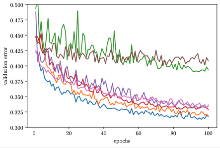
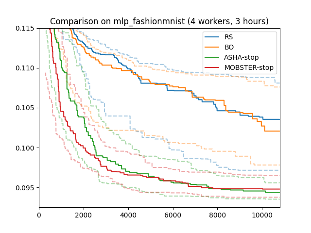
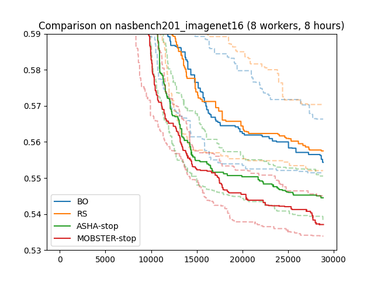
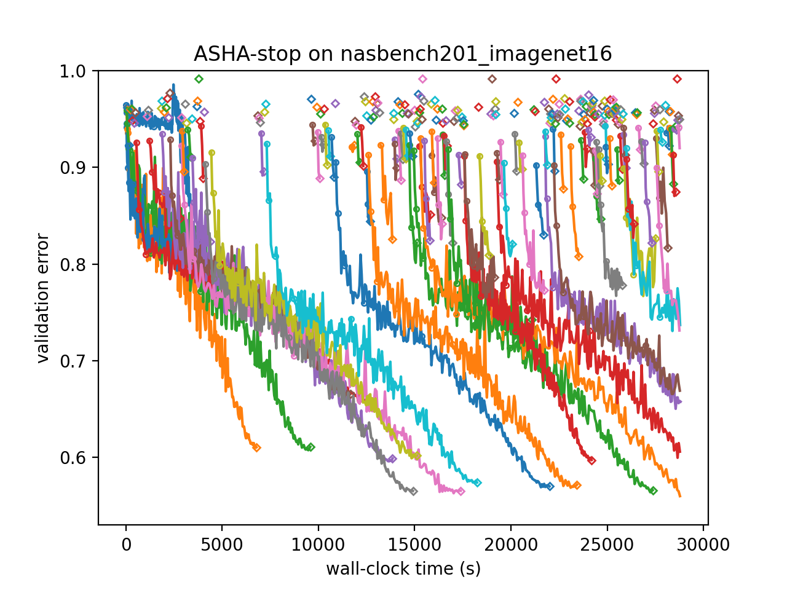
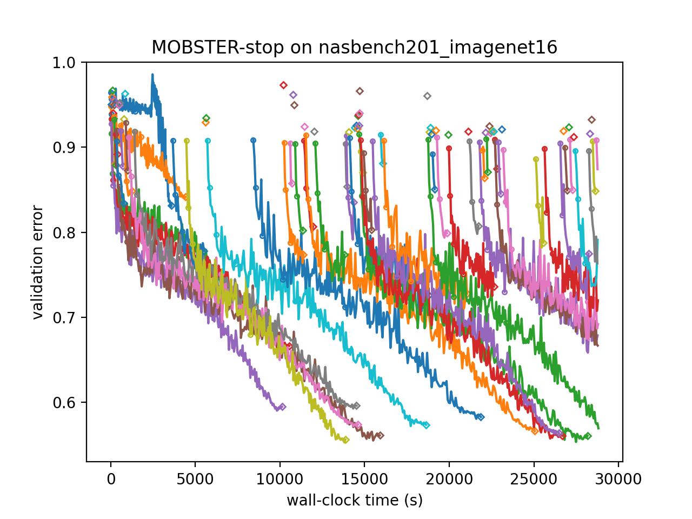

Model-Based Asynchronous Successive Halving
===========================================

Extrapolating Learning Curves
-----------------------------

+------------------------------------------+
| |Learning Curves|                        |
+==========================================+
| Learning Curves (image from Aaron Klein) |
+------------------------------------------+

By modelling metric data from earlier trials, Bayesian optimization learns to
suggest more useful configurations down the line than randomly sampled ones.
Since new configurations are sampled at random in ASHA, a natural question is
how to combine it with Bayesian decision-making.

It is not immediately clear how to do this, since the data we observe per trial
are not single numbers, but learning curves (see figure above). In fact, the
most useful single function to model would be the validation error after the
final epoch (81 in our example), but the whole point of early stopping
scheduling is to query this function only very rarely. By the nature of
successive halving scheduling, we observe at any point in time a lot more data
for few epochs than for many. Therefore, Bayesian decision-making needs to
incorporate some form of *learning curve extrapolation*.

One way to do so is to build a *joint probabilistic model* of all the data. The
validation metric reported at the end of epoch :math:`r` for configuration
:math:`\mathbf{x}` is denoted as :math:`f(\mathbf{x}, r)`. In order to allow
for extrapolation from small :math:`r` to :math:`r_{max}` (81 in our example),
our model needs to capture dependencies along epochs. Moreover, it also has
to represent dependencies between learning curves for different configurations,
since otherwise we cannot use it to score the value of a new configuration we
have not seen data from before.

MOBSTER
-------

A simple method combining ASHA with Bayesian optimization is
`MOBSTER <https://openreview.net/forum?id=a2rFihIU7i>`__. It restricts
Bayesian decision-making to proposing configurations for new trials, leaving
scheduling decisions for existing trials (e.g., stopping, pausing, promoting)
to ASHA. Recall from
`Bayesian Optimization <basics_bayesopt.html#what-is-bayesian-optimization>`__
that we need two ingredients: a surrogate model :math:`f(\mathbf{x}, r)` and
an acquisition function :math:`a(\mathbf{x})`:

* Surrogate model: MOBSTER uses joint surrogate models of
  :math:`f(\mathbf{x}, r)` which start from a Gaussian process model over
  :math:`\mathbf{x}` and extend it to learning curves, such that the
  distribution over :math:`f(\mathbf{x}, r)` remains jointly Gaussian. This is
  done in several different ways, which are detailed below.

* Acquisition function: MOBSTER adopts an idea from
  `BOHB <https://arxiv.org/abs/1807.01774>`__, where it is argued that the
  function of interest is really :math:`f(\mathbf{x}, r_{max})` (where
  :math:`r_{max}` is the full number of epochs), so expected improvement for
  this function would be a reasonable choice. However, this requires at least
  a small number of observations at this level. To this end, we use expected
  improvement for the function :math:`f(\mathbf{x}, r_{acq})`, where
  :math:`r_{acq}` is the largest resource level for which a certain (small)
  number of observations are available.

These choices conveniently reduce MOBSTER to a Bayesian optimization searcher
of similar form than without early stopping. One important difference is of
course that a lot more data is available now, which has scaling implications
for the surrogate model. More details about MOBSTER, and further options not
discussed here, are given in `this tutorial <../multifidelity/README.html>`__.

Our `launcher script <basics_randomsearch.html#launcher-script-for-random-search>`__
runs stopping-based MOBSTER with the argument ``--method MOBSTER-STOP``. At
least if defaults are chosen, this is much the same as for ``ASHA-STOP``.
However, we can configure the surrogate model with a range of options, which
are detailed `here <../multifidelity/mf_async_model.html>`__.

Results for MOBSTER
-------------------

+-----------------------+
| |Results for MOBSTER| |
+=======================+
| Results for MOBSTER   |
+-----------------------+

Here are results for our running example (4 workers; 3 hours; median, 25/75
percentiles over 50 repeats). MOBSTER performs comparably to ASHA on this
example. As with Bayesian optimization versus random search, it would need
more time in order to make a real difference.

Results on NASBench201 (ImageNet-16)
~~~~~~~~~~~~~~~~~~~~~~~~~~~~~~~~~~~~

We repeated this comparison on a harder benchmark problem:
`NASBench-201 <https://arxiv.org/abs/2001.00326>`__, on the ImageNet-16
dataset. Here, ``r_max = 200``, and rung levels are ``1, 3, 9, 27, 81, 200``.
We used 8 workers and 8 hours experiment time, and once more report median
and 25/75 percentiles over 50 repeats. Now, after about 5 hours, MOBSTER
starts to break away from ASHA and performs significantly better.

+--------------------------------------+
| |Results on NASBench201|             |
+======================================+
| Results on NASBench201 (ImageNet-16) |
+--------------------------------------+

In order to understand why MOBSTER outperforms ASHA, we can visualize the
learning curves of trials. In these plots, neighboring trials are assigned
different colors, circles mark rung levels, and diamonds mark final rung
levels reached.

+----------+----------+
| ASHA     | MOBSTER  |
+==========+==========+
| |image1| | |image2| |
+----------+----------+

We can see that ASHA continues to suggest poor configurations at a constant
rate. While these are stopped after 1 epoch, they still take up valuable
resources. In contrast, MOBSTER quickly learns how to avoid the worst
configurations and spends available resource more effectively.
