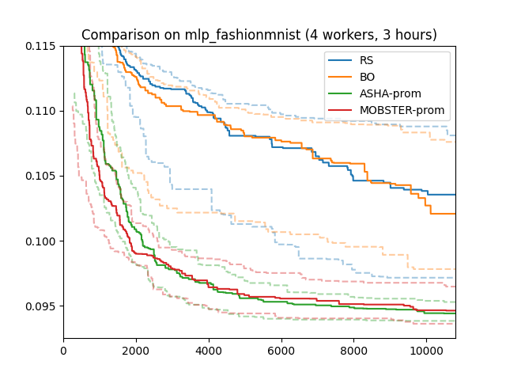

Promotion-based Scheduling
==========================

Pause and Resume. Checkpointing of Trials
-----------------------------------------

As we have seen, one way to implement early stopping scheduling is to make
trials report metrics at certain points (rung levels), and to stop them when
their performance falls behind other trials. This is conceptually simple. A
trial maps to a single training run, and it is very easy to annotate training
code in order to support automated tuning.

Another idea is *pause and resume*. Here, a trial may be paused at the end of
an epoch, releasing its worker. Any paused trial may be resumed later on when
a worker becomes available, which means that it continues training where it
left when paused. Synchronous schedulers need pause and resume, since trials
reach a synchronization point at different times, and earlier ones have to wait
for the slowest one. For asynchronous schedulers, pause and resume is an
alternative to stopping trials, which can often work better. While a paused
trial needs no resources, it can be resumed later on, so its past training time
is not wasted.

However, *pause and resume* needs more support from the training script, which
has to make sure that a paused trial can be resumed later on, continuing
training as if nothing happened in between. To this end, the *state* of the
training job has to be checkpointed (i.e., stored into a file). The
`training script <basics_asha.html#scripts-for-asynchronous-successive-halving>`__
has to be modified once more, by replacing ``objective`` with this code:

.. literalinclude:: code/traincode_report_withcheckpointing.py
   :caption: traincode_report_withcheckpointing.py
   :start-after: # permissions and limitations under the License.

Checkpointing requires you to implement the following:

* [1] A checkpoint has to be written at the end of each epoch. The precise content
  of the checkpoint depends on the training script, but it has to contain the
  epoch at which it was written. It is recommended to write the checkpoint
  before reporting metrics to Syne Tune, since otherwise the writing of the
  checkpoint may be jeopardized by Syne Tune trying to stop the script.
* [2] A checkpoint is to be loaded just before the start of the training loop. If
  the checkpoint file is present and the state can be restored, the training
  loop starts with the epoch ``resume_from + 1``, where the checkpoint was
  written at the end of epoch ``resume_from``. Otherwise, ``resume_from = 0``,
  and the training loop starts from scratch.
* [3] Checkpointing requires additional input arguments. You can add them by
  hand or use ``add_checkpointing_to_argparse``. The most important is the
  local directory name where the checkpoint should be written or loaded from.
  A checkpoint may consist of different files. If this argument is not passed
  to the script, checkpointing is deactivated.

Syne Tune provides some helper functions for checkpointing, see
`FAQ <../../faq.html#how-can-i-enable-trial-checkpointing>`__.

* ``checkpoint_model_at_rung_level(config, save_model_fn, epoch)`` stores
  a checkpoint at the end of epoch ``epoch``. The main work is done by
  ``save_model_fn``.
* ``resume_from = resume_from_checkpointed_model(config, load_model_fn)``
  loads a checkpoint, and returns its epoch if successful. Otherwise, 0 is
  returned. Again, ``load_model_fn`` does the main work.
* ``pytorch_load_save_functions``: If you use *PyTorch*, this is providing
  ``save_model_fn``, ``load_model_fn`` that should work for you. In
  ``state_dict_objects``, you pass a dict of PyTorch objects with a mutable
  state (look for ``load_state_dict``, ``state_dict`` methods). Make sure to
  include all relevant objects (model, algorithm, learning rate scheduler).
  Optionally, ``mutable_state`` contains additional elementary variables.

Note that while checkpoints are written at the end of each epoch, the most
recent one overwrites previous ones. In fact, for the purpose of pause and
resume, checkpoints have to be written only at rung levels, because trials can
only be paused there. Selective checkpointing could be supported by passing the
rung levels to the training script, but this is currently not done in Syne
Tune.

Our `launcher script <basics_randomsearch.html#launcher-script-for-random-search>`__
runs promotion-based ASHA with the argument ``--method ASHA-PROM``, and
promotion-based MOBSTER with ``--method MOBSTER-PROM``:

* Recall that the argument ``max_resource_attr`` for
  :class:`~syne_tune.optimizer.schedulers.HyperbandScheduler` allows the
  scheduler to infer the maximum resource level ``r_max``. For
  promotion-based scheduling, this argument has a second function. Namely, it
  allows the scheduler to inform the training script until which epoch it has
  to train, so it does not have to be stopped anymore from the outside. For
  example, say that a trial paused at ``r=3`` is promoted to run until the next
  rung level ``r=9``. The scheduler calls the training script with
  ``config[max_resource_attr] = 9`` (instead of 81). It is resumed from its
  ``r=3`` checkpoint and runs epochs 4, 5, 6, 7, 8, 9, then terminates by
  itself. If ``max_resource_attr`` is not used, training scripts are started
  to be run until the end, and they need to be stopped by the backend.
  Depending on the backend, there can be a delay between a stopping signal
  being sent and a worker coming available again, which is avoided if
  ``max_resource_attr`` is used. Moreover, future backends may be able to use
  the information on how long a resumed trial needs to be run until paused for
  improved scheduling.
* Syne Tune allows promotion-based schedulers to be used with training scripts
  which do not implement checkpointing. Our launcher script would just as well
  work with ``traincode_report_eachepoch.py``. In this case, a trial to be
  resumed is started from scratch, and metric reports up to the resume epoch
  are ignored. For example, say a trial paused at ``r=3`` is resumed. If the
  training script does not implement checkpointing, it will start from scratch
  and report for ``r = 1, 2, 3, 4, ...``. The scheduler discards the first 3
  reports in this case. However, it is strongly recommended to implement
  checkpointing if promotion-based scheduling is to be used.

Early Removal of Checkpoints
~~~~~~~~~~~~~~~~~~~~~~~~~~~~

By default, the checkpoints written by all trials are retained on disk (for a
trial, later checkpoints overwrite earlier ones). When checkpoints are large
and the local backend is used, this may result in a lot of disk space getting
occupied, or even the disk filling up. Syne Tune supports checkpoints being
removed once they are not needed anymore, or even speculatively, as is detailed
`here <../../faq.html#checkpoints-are-filling-up-my-disk-what-can-i-do>`__.

Results for promotion-based ASHA and MOBSTER
--------------------------------------------

+-----------------------------------------------------------------------+
| |Results for promotion-based ASHA and MOBSTER|                        |
+=======================================================================+
| Results for promotion-based ASHA and MOBSTER                          |
+-----------------------------------------------------------------------+

Here are results for our running example (4 workers; 3 hours; median, 25/75
percentiles over 50 repeats). These results are rather similar to what we
obtained for stopping-based scheduling, except the random variations are
somewhat larger for ASHA stopping than for ASHA promotion.

It is not a priori clear when stopping or promotion-based scheduling will work
better. When it comes to the backend, promotion-based scheduling needs
checkpointing, and the backend needs to efficiently handle the transfer of
checkpoints between workers. On the other hand, promotion-based scheduling does
not require the backend to stop jobs (see ``max_resource_attr`` discussion
above), which can be subject to delays in some backends. Run with the local
backend, where delays play no role, stopping and promotion-based scheduling
can behave quite differently. In our experiments, we have often observed that
stopping can be more efficient at the beginning, while promotion has an edge
during later stages.

Our recommendation is to implement checkpointing in your training script,
which gives you access to all Syne Tune schedulers, and then to gain some
experience with what works best for your problem at hand.
