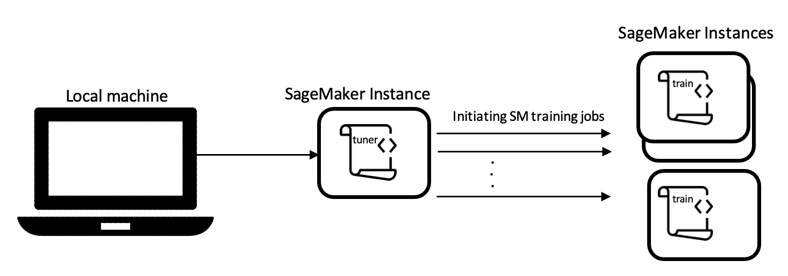

# Basics of Syne Tune: Concepts and Terminologies

Syne Tune is a library for large-scale distributed hyperparameter optimization. 
It has a modular architecture and its core modules are _tuner_,  _backend_, _scheduler_ and
 _benchmarking_. In this section, we first introduce key terminologies in hyperparameter optimization (HPO) domain, and next describe above-mentioned modules.

## Terminologies
In HPO domain, a specific settings/values of hyperparameters is referrd to as _configuration_.
The _search space_ is the domain of a configuration i.e. scale and range of each hyperparameter.
The evaluation of the underlying ML task on a given configuration is referred as _trial_.

## Syne Tune modules
Syne Tune consists of four core modules: _tuner_,  _backend_, _scheduler_ and _benchmarking_.
On a high level, _Tuner_ orchestrates the overall search for the best configuration. Tuner interacts with a _backend_,
which launches new trials (i.e., evaluations of configurations) in parallel and retrieves evaluation
results. Decisions on which trials to launch or interrupt are delegated to a _scheduler_, which is
synonymous with “HPO algorithm” in Syne Tune. 

### Tuner
Tuner moderates the HPO process by interacting with _scheduler_ and _backend_. 
It queries the _scheduler_ for a trial when a worker is free, and pass the trial to the backend
for execution.  

### Scheduler
In Syne Tune, HPO algorithms are called _schedulers_. 
Schedulers search for a new, most promising configuration and suggest it as a new trial to _tuner_. 
Some schedulers may decide to resume a paused trial instead of suggesting a new one.
Schedulers are also in charge of stopping running trials. Syne Tune supports many schedulers including multi-fidelity ones and asynchronous ones.

### Backend
The backend module is responsible for starting, stopping, pausing and resuming trials and accessing
results and trial statuses. Syne Tune supports three execution backends to facilitate experimentations: local backend, SageMaker backend, and simulated backend. 
To explain these backends, recall that any HPO job consists of two main scripts: a tuner script where HPO loop runs and next configurations from search space is selected, and a training script where the machine learning model (whether it is a neural network or a tree-based model) is trained based on the selected hyperparameter configuration from tuner.
The execution backend runs these scripts; and depending on whether they are executed on one or multiple machines, the execution backend changes.  

Local backend runs the training job locally with respect to where tuner job is running. That is if both tuner script and training script run on the same machine (whether it is your local machine or in cloud) it is local backend. 
Figures \ref and \ref demonstrates local backend, where in Figure \ref{} both scripts are executed on local machine, and in Figure \ref{} they are executed on a SageMaker instance in cloud. 


<table>
  <tr>
    <td style="border-color: white; width: 600px">
    <figcaption>Local backend on a local machine</figcaption>
    </td>
    <td style="border-color: white">
    <figcaption> Local backend when running on a SageMaker instance on cloud</figcaption>
    </td>
  </tr>
</table>


Local backend evaluates trials concurrently on a single machine by using subprocesses.
SyneTune support rotating multiple GPUs on the machine, assigning the next trial to the least
busy GPU, e.g. the GPU with the smallest amount of trials currently running. 

Local backend suffers from two shortcomings; first, it limits the number of trials that can run concurrently.
Second, it falls short in training neural network which require many GPUs, or possibly distributed across several nodes


SageMaker backend covers this gap by executing training script in cloud and specifically in an Amazon SageMaker instance while the tuner script runs either from your local machine or from another SageMaker instance in cloud. 
Figure x and y show these settings respectively. 
SageMaker backend schedules one training job per trial. 
In addition, Amazon SageMaker provides pre-build containers of ML frameworks
(e.g., Pytorch, TensorFlow, Scikit-learn, HuggingFace) and enables users of training on cheaper preemptible machines.

<table >
  <tr>
    <td style="border-color: white; width: 600px">
    <figcaption>SageMaker backend with tuner running from local machine</figcaption>
    </td>
    <td style="border-color: white">
    <figcaption> SageMaker backend with both tuner and training scripts running on cloud</figcaption>
    </td>
  </tr>
</table>

In SageMaker backend, Eeach trial is run as a separate SageMaker training job. This is useful for expensive workloads, 
where all resources of an instance (or several ones) are used for training. On the other hand, training job start-up overhead is incurred for every trial.


It is worthy to note that Syne Tune is agnostic to execution backend, 
and users can effortlessly change between backends by modifying input argument `trial_backend` in instantiating `Tuner`. 
See [launch_randomsearch.py](scripts/launch_randomsearch.py) for an example of local backend where `entry_point` is the training script.

```python
from syne_tune.backend import LocalBackend
from syne_tune import Tuner

trial_backend = LocalBackend(entry_point=entry_point)

tuner = Tuner(
        trial_backend=trial_backend,
        scheduler=scheduler,
        stop_criterion=stop_criterion,
        n_workers=n_workers,
    )
```

See [launch_sagemaker_backend.py](scripts/launch_sagemaker_backend.py) for an example of SageMaker backend, where
a PyTorch container on `ml.m4.xlarge` instance is picked to run the training script (i.e.`entry_point`).
```python
from syne_tune.backend import SageMakerBackend
from syne_tune import Tuner

trial_backend = SageMakerBackend(
    # we tune a PyTorch Framework from Sagemaker
    sm_estimator=PyTorch(
        entry_point=entry_point,
        instance_type="ml.m4.xlarge",
        instance_count=1,
        role=get_execution_role(),
        dependencies=[str(repository_root_path() / "benchmarking")],
        max_run=int(1.05 * max_wallclock_time),
        framework_version="1.7.1",
        py_version="py3",
        disable_profiler=True,
        sagemaker_session=default_sagemaker_session(),
    ),
    metrics_names=[metric],
)
```
[TODO] simulated backend

### Benchmarking


