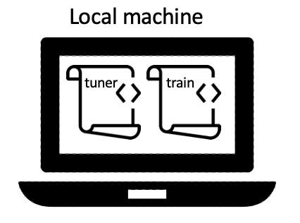
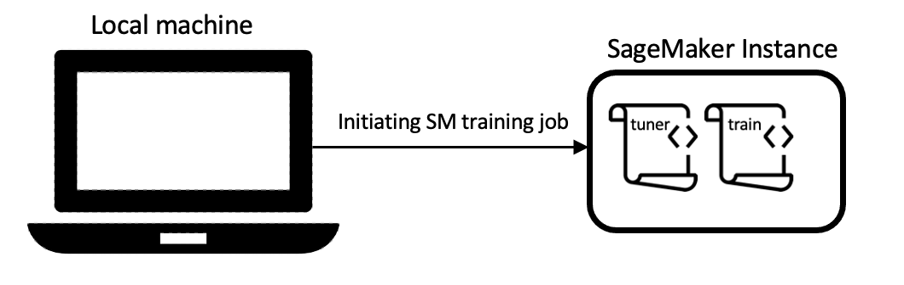
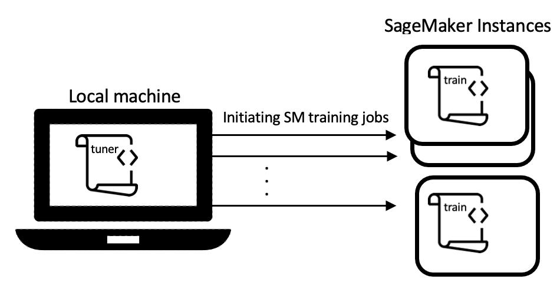
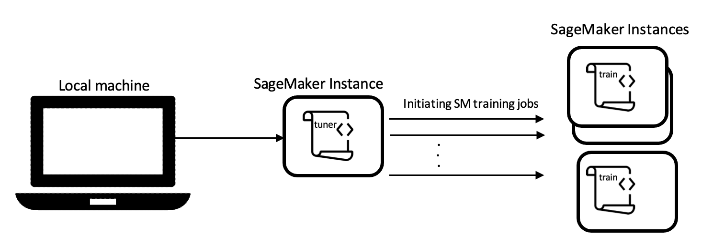

Concepts and Terminology
========================

Syne Tune is a library for large-scale distributed hyperparameter optimization
(HPO). Here is some basic terminology. A specific set of values for
hyperparameters is called a *configuration*. The *configuration space* is the
domain of a configuration, prescribing type and valid range of each hyperparameter.
Finally, a *trial* refers to an evaluation of the underlying machine learning
model on a given configuration. A trial may result in one or more observations, for
example the validation error after each epoch of training the model. Some HPO
algorithms may pause a trial and restart it later in time.

HPO experiments in Syne Tune involve the interplay between three components:
*Tuner*, *Backend*, and *Scheduler*. There is also dedicated tooling for
*Benchmarking*.

Tuner
-----

The :class:`~syne_tune.Tuner` orchestrates the overall search for the best
configuration. It does so by interacting with *scheduler* and *backend*. It
queries the scheduler for a new configuration to evaluate whenever a worker is
free, and passes this suggestion to the backend for the execution of this trial.

Scheduler
---------

In Syne Tune, HPO algorithms are called *schedulers* (base class
:class:`~syne_tune.optimizer.scheduler.TrialScheduler`). They search for a new,
most promising configuration and suggest it as a new trial to the tuner. Some
schedulers may decide to resume a paused trial instead of suggesting a new one.
Schedulers may also be in charge of stopping running trials. Syne Tune supports
`many schedulers <../../getting_started.html#supported-hpo-methods>`__, including
`multi-fidelity <../multifidelity/README.html>`__ methods.

Backend
-------

The *backend* module is responsible for starting, stopping, pausing and resuming
trials, as well as accessing results reported by trials and their statuses (base
class :class:`~syne_tune.backend.trial_backend.TrialBackend`). Syne Tune currently supports four
execution backends to facilitate experimentations: **local backend**,
**Python backend**, **SageMaker backend**, and **simulator backend**.
Recall that an HPO experiment is defined by two scripts. First, a launcher script
which configures the configuration space, the backend, and the scheduler, then
starts the tuning loop. Second, a training script, in which the machine learning
model of interest (e.g., a deep neural network, or gradient boosted decision trees)
is trained for a fixed hyperparameter configuration, and some validation metric is
reported, either at the end or after each epoch of training. It is the responsibility
of the backend to execute the training script for different configurations, often in
parallel, and to relay their reports back to the tuner.

Local Backend
~~~~~~~~~~~~~

Class :class:`~syne_tune.backend.LocalBackend`. This backend runs
each training job locally, on the same machine as the tuner. Each training job is
run as a subprocess. Importantly, this means that the *number of workers*, as
specified by ``n_workers`` passed to :class:`~syne_tune.Tuner`, must be smaller or
equal to the number of independent resources on this machine, e.g. the number of
GPUs or CPU cores. Experiments with the local backend can either be launched on
your current machine (in which case this needs to own the resources you are
requesting, such as GPUs), or you can
`launch the experiment remotely <../../faq.html#i-dont-want-to-wait-how-can-i-launch-the-tuning-on-a-remote-machine>`__
as a SageMaker training job, using an instance type of your choice. The figure
below demonstrates the local backend. On the left, both scripts are executed on
the local machine, while on the right, scripts are run remotely.

+----------------------------------------------------------+-----------------------------------------+
| |image1|                                                 | |image2|                                |
+==========================================================+=========================================+
| Local backend on a local machine                         | Local backend when running on SageMaker |
+----------------------------------------------------------+-----------------------------------------+

Syne Tune support rotating multiple GPUs on the machine, assigning the next trial
to the least busy GPU, e.g. the GPU with the smallest amount of trials currently
running.

The local backend is simple and has very small delays for starting, stopping, or
resuming trials. However, it also has shortcomings. Most importantly, the number
of trials which can run concurrently, is limited by the resources of the chosen
instance. If GPUs are required, each trial is limited to using a single GPU, so
that several trials can run in parallel.

The **Python backend** (:class:`~syne_tune.backend.PythonBackend`) is simply a
wrapper around the local backend, which allows you to define an experiment in a
single script (instead of two).

SageMaker Backend
~~~~~~~~~~~~~~~~~

Class :class:`~syne_tune.backend.SageMakerBackend`. This backend
runs each trial evaluation as a separate SageMaker training job. Given sufficient
instance limits, you can run your experiments with any number of workers you like,
and each worker may use all resources on the executing instance. It is even
possible to execute trials on instances of different types, which allows for
`joint tuning of hyperparameters and compute resources <../../examples.html#joint-tuning-of-instance-type-and-hyperparameters-using-moasha>`__.
The figure below demonstrates the SageMaker backend. On the left, the launcher
script runs on the local machine, while on the right, it is run remotely.

+-----------------------------------------------+---------------------------------------------------+
|  |image3|                                     | |image4|                                          |
+===============================================+===================================================+
| SageMaker backend with tuner running locally  | SageMaker backend with tuner running on SageMaker |
+-----------------------------------------------+---------------------------------------------------+

The SageMaker backend executes each trial as independent SageMaker training job,
This allows you to use any instance type and configuration you like. Also, you
may use any of the SageMaker frameworks, from ``scikit-learn`` over ``PyTorch``
and ``TensorFlow``, up to dedicated frameworks for distributed training. You may
also
`bring your own Docker image <../../examples.html#launch-with-sagemaker-backend-and-custom-docker-image>`__.

This backend is most suited to tune models for which training is fairly expensive.
SageMaker training jobs incur certain delays for starting or stopping, which are
not present in the local backend. The SageMaker backend can be sped up by using
`SageMaker managed warm pools <../benchmarking/bm_sagemaker.html#using-sagemaker-managed-warm-pools>`__.

Simulator Backend
~~~~~~~~~~~~~~~~~

Class :class:`~syne_tune.blackbox_repository.BlackboxRepositoryBackend`.
This backend is useful for comparing HPO methods, or variations of such methods.
It runs on a *tabulated or surrogate benchmark*, where validation metric data
typically obtained online by running a training script has been precomputed
offline. In a corporate setting, simulation experiments are useful for unit and
regression testing, but also to speed up evaluations of prototypes. More details
are given `here <../benchmarking/bm_simulator.html>`__, and in
`this example <../../examples.html#launch-hpo-experiment-with-simulator-backend>`__.

The main advantage of the simulator backend is that it allows for realistic
experimentation at very low cost, and running order of magnitude faster than
real time. A drawback is the upfront cost of generating a tabulated benchmark
of sufficient complexity to match the real problem of interest.

Importantly, Syne Tune is agnostic to which execution backend is being used. You
can easily switch between backends by changing the ``trial_backend`` argument
in :class:`~syne_tune.Tuner`:

* `launch_height_baselines.py <../../examples.html#launch-hpo-experiment-locally>`__
  provides an example for launching experiments with the local backend
* `launch_height_python_backend.py <../../examples.html#launch-hpo-experiment-with-python-backend>`__
  provides an example for launching experiments with the Python backend
* `launch_height_sagemaker.py <../../examples.html#launch-hpo-experiment-with-sagemaker-backend>`__
  provides an example for launching experiments with the SageMaker backend
* `launch_nasbench201_simulated.py <../../examples.html#launch-hpo-experiment-with-simulator-backend>`__
  provides an example for launching experiments with the simulator backend

Benchmarking
------------

A benchmark is a collection of meta-datasets from different configuration spaces,
where the exact dataset split, the evaluation protocol, and the performance
measure are well-specified. Benchmarking allows for experimental reproducibility
and assist us in comparing HPO methods on the specified configurations.
Refer to `this tutorial <../benchmarking/README.html>`__ for a complete guide on
benchmarking in Syne Tune.
