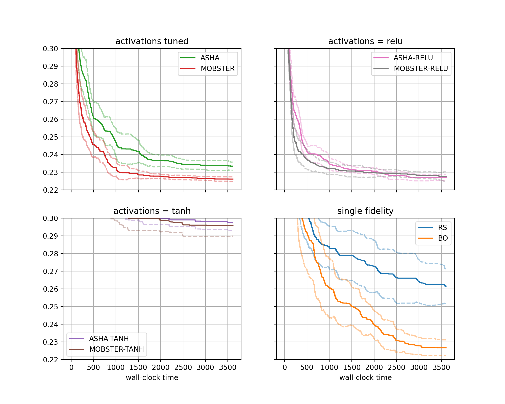

Visualization of Results
========================

Once all results are obtained, we would rapidly like to create comparative plots.
In Syne Tune, each experiment stores two files, ``metadata.json`` with metadata,
and ``results.csv.zip`` containing time-stamped results. The
:class:`~syne_tune.Tuner` object at the end of the experiment is also serialized
to ``tuner.dill``, but this is not needed here.

.. note::
   This section offers an example of the plotting facilities in Syne Tune. More
   details are provided in `this tutorial <../visualization/README.html>`__.

First, we need to download the results from S3 to the local disk. This can be
done by a command which is also printed at the end of ``launch_remote.py``:

.. code-block:: bash

   aws s3 sync s3://<BUCKET-NAME>/syne-tune/docs-2/ ~/syne-tune/docs-2/ \
     --exclude "*" --include "*metadata.json" --include "*results.csv.zip"

This command can also be run from inside the plotting code. Note that the
``tuner.dill`` result files are not downloaded, since they are not needed for
result visualization.

Here is the code for generating result plots for two of the benchmarks:

.. literalinclude:: ../../../../benchmarking/examples/demo_experiment/plot_results.py
   :caption: benchmarking/examples/demo_experiment/plot_results.py
   :start-after: # permissions and limitations under the License.

The figure for benchmark ``fcnet-protein`` looks as follows:

+-------------------------------------+
| |Results for fcnet-protein|         |
+=====================================+
| Results for FCNet (protein dataset) |
+-------------------------------------+

Moreover, we obtain an output for extra results, as follows:

.. code-block:: bash

   [ASHA]:
     num_at_level1: [607, 630, 802, 728, 669, 689, 740, 610, 566, 724, 691, 812, 837, 786, 501, 642, 554, 625, 531, 672]
     num_at_level3: [234, 224, 273, 257, 247, 238, 271, 222, 191, 256, 240, 273, 287, 272, 185, 227, 195, 216, 197, 241]
     num_at_level9: [97, 81, 99, 95, 99, 99, 106, 92, 73, 98, 90, 95, 99, 98, 74, 86, 78, 82, 85, 101]
     num_at_level27: [49, 36, 37, 36, 41, 47, 37, 43, 36, 35, 34, 37, 39, 39, 39, 44, 41, 30, 45, 49]
     num_at_level81: [22, 17, 18, 15, 21, 22, 19, 26, 20, 15, 16, 13, 13, 23, 27, 29, 20, 17, 20, 26]
   [MOBSTER]:
     num_at_level1: [217, 311, 310, 353, 197, 96, 377, 135, 364, 336, 433, 374, 247, 282, 175, 302, 187, 225, 182, 240]
     num_at_level3: [107, 133, 124, 138, 104, 64, 163, 72, 157, 132, 146, 140, 123, 112, 110, 129, 90, 100, 86, 126]
     num_at_level9: [53, 62, 55, 59, 66, 51, 83, 47, 72, 55, 54, 59, 54, 51, 72, 65, 60, 49, 55, 70]
     num_at_level27: [29, 34, 30, 26, 50, 37, 49, 31, 27, 25, 23, 28, 27, 28, 49, 33, 42, 27, 34, 45]
     num_at_level81: [18, 20, 16, 14, 33, 25, 37, 24, 13, 17, 10, 14, 17, 20, 32, 24, 29, 15, 26, 31]
   [ASHA-TANH]:
     num_at_level1: [668, 861, 755, 775, 644, 916, 819, 710, 694, 870, 764, 786, 769, 710, 862, 807, 859, 699, 757, 794]
     num_at_level3: [237, 295, 265, 272, 221, 311, 302, 246, 246, 294, 278, 280, 276, 240, 297, 290, 304, 258, 270, 279]
     num_at_level9: [86, 112, 101, 97, 91, 104, 119, 90, 92, 104, 98, 96, 98, 90, 108, 120, 105, 109, 105, 102]
     num_at_level27: [37, 47, 39, 39, 40, 39, 45, 44, 39, 41, 41, 44, 44, 40, 45, 43, 38, 53, 49, 39]
     num_at_level81: [21, 16, 16, 16, 20, 16, 17, 18, 17, 14, 18, 21, 21, 20, 17, 19, 16, 19, 23, 20]
   [MOBSTER-TANH]:
     num_at_level1: [438, 594, 462, 354, 307, 324, 317, 359, 483, 523, 569, 492, 516, 391, 408, 565, 492, 322, 350, 479]
     num_at_level3: [166, 206, 156, 135, 133, 127, 129, 131, 175, 211, 191, 165, 178, 169, 151, 204, 164, 122, 132, 205]
     num_at_level9: [69, 75, 56, 54, 78, 60, 57, 60, 76, 80, 72, 56, 72, 103, 67, 77, 63, 48, 59, 92]
     num_at_level27: [36, 35, 25, 28, 45, 37, 27, 36, 46, 27, 37, 26, 37, 58, 31, 36, 26, 28, 33, 39]
     num_at_level81: [20, 13, 12, 11, 23, 20, 13, 20, 23, 10, 13, 9, 18, 31, 16, 18, 11, 16, 19, 21]
   [ASHA-RELU]:
     num_at_level1: [599, 670, 682, 817, 608, 585, 770, 397, 613, 721, 599, 601, 618, 718, 613, 674, 715, 638, 598, 652]
     num_at_level3: [201, 246, 242, 277, 225, 209, 282, 140, 212, 245, 202, 205, 215, 245, 207, 239, 238, 224, 221, 234]
     num_at_level9: [75, 94, 94, 100, 89, 92, 101, 60, 78, 89, 76, 82, 80, 98, 86, 96, 83, 84, 90, 91]
     num_at_level27: [37, 43, 36, 34, 40, 45, 39, 35, 34, 31, 40, 40, 38, 39, 35, 34, 29, 34, 41, 35]
     num_at_level81: [23, 19, 14, 13, 19, 21, 15, 24, 17, 13, 20, 18, 19, 18, 20, 16, 13, 15, 22, 17]
   [MOBSTER-RELU]:
     num_at_level1: [241, 319, 352, 438, 354, 386, 197, 262, 203, 387, 320, 139, 359, 401, 334, 294, 361, 403, 178, 141]
     num_at_level3: [110, 156, 135, 166, 138, 143, 104, 124, 95, 136, 133, 71, 133, 151, 130, 122, 134, 151, 92, 74]
     num_at_level9: [50, 83, 59, 75, 59, 55, 57, 72, 53, 53, 58, 40, 62, 63, 61, 54, 52, 65, 48, 47]
     num_at_level27: [31, 51, 29, 31, 29, 23, 39, 38, 36, 20, 29, 36, 32, 29, 32, 29, 24, 27, 31, 34]
     num_at_level81: [20, 35, 12, 11, 12, 15, 22, 18, 26, 12, 16, 27, 16, 15, 20, 15, 15, 13, 18, 22]

* There are four subfigures arranged as two-by-two matrix. Each contains two
  curves in bold, along with confidence intervals. The horizontal axis
  depicts wall-clock time, and on the vertical axis, we show the best
  metric value found until this time.
* More general, the data from our 640 experiments can be grouped w.r.t.
  subplot, then *setup*. Each setup gives rise to one curve (bold, with
  confidence band). Subplots are optional, the default is to plot a single
  figure.
* The function ``metadata_to_setup`` maps the metadata stored for an experiment
  to the setup name. In our basic case, the setup is simply the name of the
  method.
* The function ``metadata_to_subplot`` maps the metadata to the subplot
  index (0, 1, 2, 3). We group setups with the same configuration space,
  but also split multi-fidelity and single-fidelity methods.
* Once the data is grouped w.r.t. benchmark, then subplot (optional), then
  setup, we should be left with 20 experiments, one for each seed. These 20
  curves are now interpolated to a common grid, and at each grid point, the
  20 values are aggregated into ``lower``, ``aggregate``, ``upper``. In the
  figure, ``aggregate`` is shown in bold, and ``lower``, ``upper`` in dashed.
  Different aggregation modes are supported (selected by
  ``plot_params.aggregate_mode``).
* We pass ``extra_results_keys`` to the
  :meth:`~syne_tune.experiments.ComparativeResults.plot` method in order to
  also retrieve extra results. This method returns a dictionary, whose
  "extra_results" entry is what we need.

Advanced Experimenting
----------------------

Once you start to run many experiments, you will get better at avoiding
wasteful repetitions. Here are some ways in which Syne Tune can support you.

* Combining results from several studies: It often happens that results for
  a new idea need to be compared to baselines on a common set of benchmarks.
  You do not have to re-run baselines, but can easily combine older results
  with more recent ones. This is explained
  `here <../visualization/comparisons.html#combining-sesults-from-multiple-studies>`__.
* When running many experiments, some may fail. Syne Tune supports you in not
  having to re-run everything from scratch. As already noted above, when
  creating aggregate plots, it is important not to use incomplete results
  stored for failed experiments. The cleanest way to do so is to remove these
  results on S3. Another option is to filter out corrupt results:

  * If you forget about removing such corrupt results, you will get a reminder
    when creating :class:`~syne_tune.experiments.ComparativeResults`. Since you
    pass the list of setup names and the number of seeds (in ``num_runs``), you
    get a warning when too many experiments have been found, along with the
    path names.
  * Results are stored on S3, using object name prefixes of the form
    ``<s3-bucket>/syne-tune/docs-2/ASHA/docs-2-fcnet-protein-7-2023-04-20-15-20-18-456/``
    or
    ``<s3-bucket>/syne-tune/docs-2/MOBSTER-7/docs-2-fcnet-protein-7-2023-04-20-15-20-00-677/``.
    The pattern is ``<tag>/<method>/<tag>-<benchmark>-<seed>-<datetime>/`` for cheap
    methods, and
    ``<tag>/<method>-<seed>/<tag>-<benchmark>-<seed>-<datetime>/`` for expensive
    methods.
  * Instead of removing corrupt results on S3, you can also
    filter them by datetime, using the ``datetime_bounds`` argument of
    :class:`~syne_tune.experiments.ComparativeResults`. This allows you define an
    open or closed datetime range for results you want to keep. If your failed
    attempts preceed the ones that finally worked out, this type of filtering can
    save you the head-ache of removing files on S3.
  * **Warning**: When you remove objects on S3 for some experiment tag, it is
    strongly recommended to remove all result files locally (so everything at
    ``~/syne-tune/<tag>/``) and sync them back from S3, using the command at
    the start of this section. ``aws s3 sync`` is prone to make mistakes
    otherwise, which are very hard to track down.
