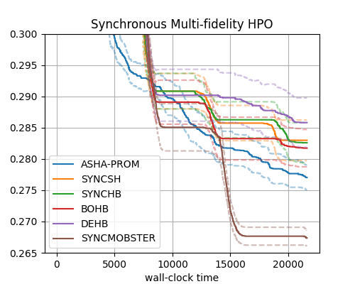
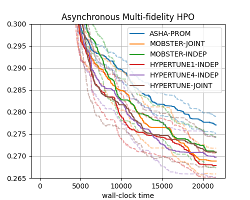
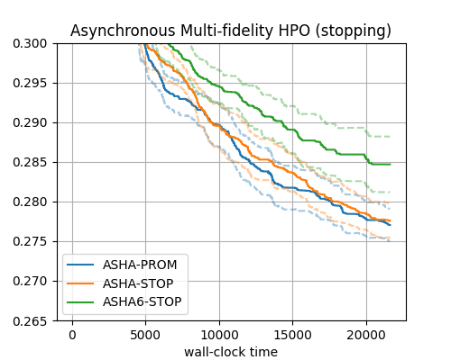

Comparison of Methods
=====================

In this section, we present an empirical comparison of all methods discussed in
this tutorial. The methodology of our study is as follows:

* We use the NASBench-201 benchmark (CIFAR100 dataset)
* All methods are run with a ``max_wallclock_time`` limit of 6 hours (or 21600
  seconds). We plot minimum validation error attained as function of wallclock
  time (which, in our case, is simulated time)
* Results are aggregated over a number of repetitions. The number of
  repetitions is 50 for SYNCSH, SYNCHB, BOHB, DEHB, ASHA-STOP, ASHA-PROM,
  ASHA6-STOP and SYNCMOBSTER, while MOBSTER-JOINT, MOBSTER-INDEP,
  HYPERTUNE1-INDEP, HYPERTUNE4-INDEP and HYPERTUNE-JOINT are repeated 30 times.
  Figures plot the interquartile mean in bold and a bootstrap 95% confidence
  interval for this estimator in dashed lines (the IQM is a robust estimator of
  the mean, but depends on more data than the median)
* SYNCSH, ASHA-STOP, ASHA-PROM, MOBSTER-JOINT, MOBSTER-INDEP, HYPERTUNE1-INDEP
  use 1 bracket, HYPERTUNE4-INDEP, HYPERTUNE-JOINT use 4 brackets, and SYNCHB,
  BOHB, DEHB, SYNCMOBSTER use the maximum of 6 brackets
* In SYNCSH, SYNCHB, ASHA-STOP, ASHA-PROM, ASHA6-STOP, new configurations are
  drawn at random, while BOHB, SYNCMOBSTER, MOBSTER-JOINT, MOBSTER-INDEP,
  HYPERTUNE1-INDEP, HYPERTUNE4-INDEP, HYPERTUNE-JOINT are variants of Bayesian
  optimization. In DEHB, configurations in the first bracket are drawn at
  random, but in later brackets, they are evolved from earlier ones
* ASHA-STOP, ASHA6-STOP use early stopping, while SYNCSH, SYNCHB, BOHB,
  SYNCMOBSTER, ASHA-PROM, MOBSTER-JOINT, MOBSTER-INDEP, HYPERTUNE1-INDEP,
  HYPERTUNE4-INDEP, HYPERTUNE-JOINT use pause-and-resume. DEHB is a synchronous
  method, but does not resume trials from checkpoints (except in the very first
  bracket)

Here are results, grouped by synchronous decision-making, asynchronous
decision-making (promotion type), and asynchronous decision-making (stopping
type). ASHA-PROM results are repeated in all plots for reference.

+--------------------------------+
| |Synchronous HPO|              |
+================================+
| Synchronous Multi-fidelity HPO |
+--------------------------------+

+---------------------------------------------+
| |Asynchronous HPO|                          |
+=============================================+
| Asynchronous Multi-fidelity HPO (promotion) |
+---------------------------------------------+

+--------------------------------------------+
| |Asynchronous Stopping|                    |
+============================================+
| Asynchronous Multi-fidelity HPO (stopping) |
+--------------------------------------------+

These results are obtained on a single benchmark with a rather small
configuration space. Nevertheless, they are roughly in line with results we
obtained on a larger range of benchmarks. A few conclusions can be drawn, which
may help readers choosing the best HPO method and its configuration for their
own problem.

* Asynchronous methods outperform synchronous ones in general, in particular
  when it comes to any-time performance. A notable exception (on this
  benchmark) is SYNCMOBSTER, which performs en par with the best asynchronous
  methods.
* Among the synchronous methods, SYNCMOBSTER performs best, followed by
  BOHB. SYNCHB and SYNCSH perform very similar. The performance of DEHB is
  somewhat disappointing on this benchmark.
* The best-performing methods on this benchmark are MOBSTER-JOINT and
  HYPERTUNE1-INDEP, with HYPERTUNE4-INDEP a close runner-up. For MOBSTER, the
  joint multi-task surrogate model should be preferred, while for HYPERTUNE,
  the independent GPs model works better.
* On this benchmark, moving to multiple brackets does not pay off for the
  asynchronous methods. However, on benchmarks where the choice of
  :math:`r_{min}` is more critical, moving beyond successive halving can be
  beneficial. In such cases, we currently recommend to use HYPERTUNE-INDEP,
  whose adaptive weighting and bracket sampling is clearly more effective than
  simpler heuristics used in Hyperband or BOHB.
