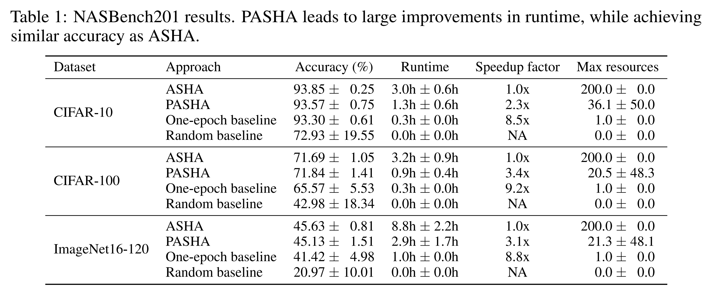

PASHA: Efficient HPO and NAS with Progressive Resource Allocation
============================================

Hyperparameter optimization (HPO) and neural architecture search (NAS) are methods
 of choice to obtain the best-in-class machine learning models, but in practice they
 can be costly to run. When models are trained on large datasets, tuning them with HPO
 or NAS rapidly becomes prohibitively expensive for practitioners, even when efficient
 multi-fidelity methods are employed. PASHA is an approach designed to tackle the challenge
 of tuning machine learning models trained on large datasets with limited
 computational resources. PASHA extends ASHA and is able to dynamically
 allocate maximum resources for the tuning procedure depending on the need.
 The experimental comparison shows that PASHA identifies well-performing hyperparameter
 configurations and architectures while consuming significantly fewer computational
 resources than ASHA.

What is PASHA?
--------------------------------------------
The goal of `PASHA <https://openreview.net/forum?id=syfgJE6nFRW>`_ is to identify
 well-performing configurations significantly faster than current methods,
 so that we can then retrain the model with the selected configuration
 (in practice on the combined training and validation sets). By giving preference
 to evaluating more configurations rather than evaluating them for longer than
 needed, PASHA can lead to significant speedups while achieving similar performance
 as existing methods.

PASHA is a variant of ASHA that starts with a small amount of initial resources
 and gradually increases them depending on the stability of configuration rankings
 in the top two rungs (rounds of promotion). Each time the ranking of configurations
 in the top two rungs becomes inconsistent, PASHA increases the maximum number
 of resources. This can be understood as "unlocking" a new rung level. An illustration
 of how PASHA stops early if the ranking of configurations has stabilized
 is shown in Figure 1.

.. image:: img/pasha_illustration.png
   :width: 768 px

Given that deep-learning algorithms typically rely on stochastic gradient descent, ranking 
inconsistencies can occur between similarly performing configurations. Hence, we need some 
benevolence in estimating the ranking. As a solution, PASHA uses a soft-ranking
 approach where we group configurations based on their validation performance metric
 (e.g. accuracy).

In soft ranking, configurations are still sorted by predictive performance but they
 are considered equivalent if the performance difference is smaller than a
 value :math `\epsilon` (or equal to it). Instead of producing a sorted list of configurations,
 this provides a list of lists where for every position of the ranking there is a list
 of equivalent configurations. The concept is explained graphically in Figure 2. 
The value of :math `\epsilon` is automatically estimated by measuring noise in rankings.

.. image:: img/soft_ranking.png
   :width: 768 px

How well does PASHA work?
--------------------------------------------

We use NASBench201 to compare PASHA with ASHA (promotion type) and the relevant baselines
 - one-epoch and random - to evaluate how well PASHA works.
The results suggest that PASHA consistently leads to strong improvements in runtime,
 while achieving similar accuracies as ASHA. The one-epoch baseline has noticeably
 worse accuracies than ASHA or PASHA, suggesting that PASHA does a good job of deciding
 when to continue increasing the resources. Random baseline
 is a lot worse than the one-epoch baseline, so there is value in performing NAS.

More extensive evaluation and further details are available in 
`PASHA: Efficient HPO and NAS with Progressive Resource Allocation <https://openreview.net/forum?id=syfgJE6nFRW>`_.

Launcher script
--------------------------------------------

We provide an example script 
`launch_pasha_nasbench201.py <https://github.com/awslabs/syne-tune/blob/main/docs/source/tutorials/pasha/scripts/launch_pasha_nasbench201.py>`_
 that shows how to run experiments with PASHA on NASBench201. The script also explains 
 how we can combine PASHA with sample-efficient strategies based on Bayesian Optimization.

Recommendations
--------------------------------------------

* PASHA is particularly useful for large-scale datasets with millions of datapoints,
 where it can lead to e.g. 15x speedup compared to ASHA.
* If only a few epochs are used for training, it is useful to define rung levels in terms
 of the number of datapoints processed rather than the number of epochs. This makes
 it possible for PASHA to stop the HPO significantly earlier and obtain a large speedup. 
* A suitable stopping criterion for PASHA is the number of configurations that have been
 evaluated so far, but it can also be evaluated using stopping criteria based on the
 wallclock time. With time-based criteria PASHA would make an impact when the stopping
 time is selected as a small value.
