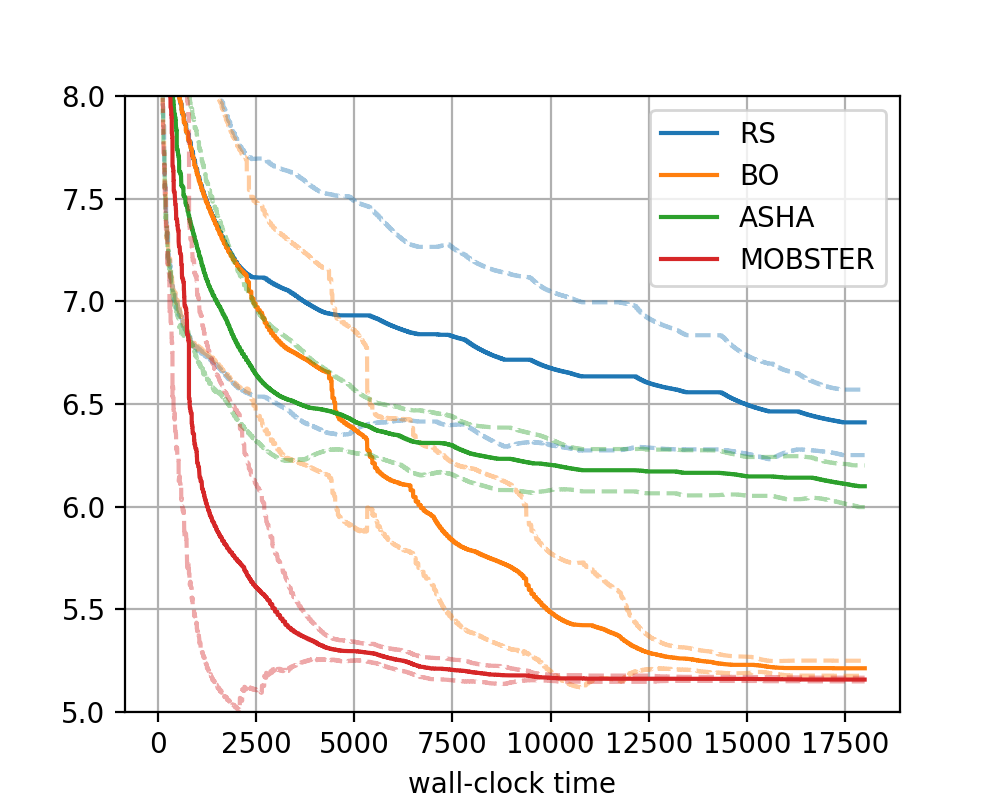

Comparing Different HPO Methods
===============================

We have learned about different methods for hyperparameter tuning:

* :class:`~syne_tune.optimizer.baselines.RandomSearch`: Sample configurations
  at random
* :class:`~syne_tune.optimizer.baselines.BayesianOptimization`: Learn how to
  best sample by probabilistic modeling of past observations
* :class:`~syne_tune.optimizer.baselines.ASHA`: Compare running trials with
  each other after certain numbers of epochs and stop those which underperform
* :class:`~syne_tune.optimizer.baselines.MOBSTER`: Combine early stopping from
  ``ASHA`` with informed sampling from ``BayesianOptimization``

How do these methods compare when applied to our ``transformer_wikitext2`` tuning
problem? In this section, we look at comparative plots which can easily be
generated with Syne Tune.

.. note::
   Besides :class:`~syne_tune.optimizer.baselines.MOBSTER`, Syne Tune provides
   a number of additional state-of-the-art model-based variants of
   :class:`~syne_tune.optimizer.baselines.ASHA`, such as
   :class:`~syne_tune.optimizer.baselines.HyperTune` or
   :class:`~syne_tune.optimizer.baselines.DyHPO`. Moreover, these methods can
   be configured in many ways, see
   `this tutorial <../multifidelity/README.html>`__.

A Comparative Study
-------------------

It is easy to compare different setups with each other in Syne Tune, be it a
number of HPO methods, or the same method on different variations, such as
different number of workers, or different configuration spaces. First,
we specify which methods to compare with each other:

.. literalinclude:: ../../../../benchmarking/nursery/odsc_tutorial/transformer_wikitext2/baselines.py
   :caption: transformer_wikitext2/baselines.py
   :start-after: # permissions and limitations under the License.

We compare random search (``RS``), Bayesian Optimization (``BO``), ASHA
(``ASHA``), and MOBSTER (``MOBSTER``), deviating from the defaults for
each method only in that we use the promotion (or pause-and-resume)
variant of the latter two. Next, we specify which baselines we would like
to consider in our study:

.. literalinclude:: ../../../../benchmarking/nursery/odsc_tutorial/transformer_wikitext2/benchmark_definitions.py
   :caption: transformer_wikitext2/benchmark_definitions.py
   :start-after: # permissions and limitations under the License.

The only benchmark we consider in this study is our ``transformer_wikitext2``
tuning problem, with its default configuration space (in general, many
benchmarks can be selected from
:func:`benchmarking.benchmark_definitions.real_benchmark_definitions.real_benchmark_definitions`).
Our study has the following properties:

* We use :class:`~syne_tune.backend.LocalBackend` as execution backend, which
  runs ``n_workers=4`` trials as parallel processes. The AWS instance type is
  ``instance_type="ml.g4dn.12xlarge"``, which provides 4 GPUs, one for each
  worker.
* We repeat each experiment 10 times with different random seeds, so that all
  in all, we run 40 experiments (4 methods, 10 seeds).

These details are specified in scripts
`hpo_main.py <remote_local.html#launching-our-study>`__ and
`launch_remote.py <remote_local.html#launching-our-study>`__, which we will
discuss in more detail in `Module 2 <remote_local.html>`__, along with the
choice of the execution backend. Once all experiments have finished (if all of
them are run in parallel, this takes a little more than ``max_wallclock_time``,
or 5 hours), we can visualize results.

+-----------------------------------------------------------+
| |Local transformer_wikitext2|                             |
+===========================================================+
| Comparison of methods on transformer_wikitext2 benchmark, |
| using the local backend with 4 workers.                   |
+-----------------------------------------------------------+

We can clearly see the benefits coming both from Bayesian optimization
(intelligent rather than random sampling) and multi-fidelity scheduling. A
combination of the two, ``MOBSTER``, provides both a rapid initial decrease
and the best performance after 5 hours.
