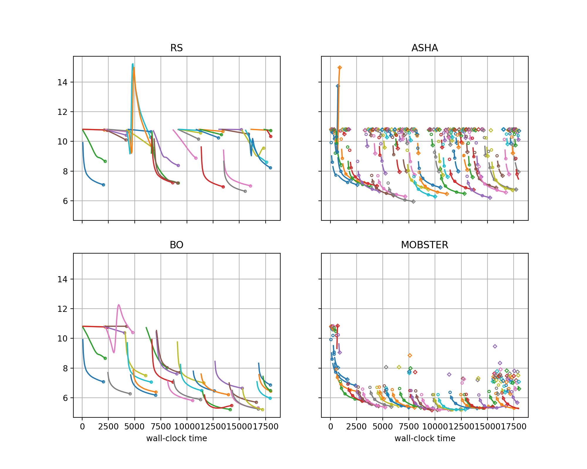

Drilling Down on Performance Differences
========================================

Often, we would like to gain an understanding about why one method performs
better than another on a given problem. In this section, we show another type
of visualization which can shed some light on this question.

Plotting Learning Curves per Trial
----------------------------------

A useful step towards understanding performance differences between setups is
to look at the learning curves of trials. Here is a script for creating such
plots for the methods compared in our
`study <comparison.html#a-comparative-study>`__:

.. literalinclude:: ../../../../benchmarking/nursery/odsc_tutorial/transformer_wikitext2/local/plot_learning_curves.py
   :caption: transformer_wikitext2/local/plot_learning_curves.py
   :start-after: # permissions and limitations under the License.

Full details about visualization of results in Syne Tune are given in
`this tutorial <../visualization/README.html>`__. In a nutshell, this is what
happens:

* The workflow is similar to comparative plots, but here, each setup
  occupies a different subfigure, and there is no aggregation over seeds
  (the seed has to be specified in ``results.plot``).
* Two of the methods compared are multi-fidelity (ASHA, MOBSTER), which is
  why additional information has to be passed as ``multi_fidelity_params``.
  This is because learning curves are plotted differently for single-fidelity,
  multi-fidelity of early stopping and of pause-and-resume type.
* With ``plot_params.subplots``, we ask for a two-by-two matrix of subfigures.
  By default, subfigures are oriented as a single row.

+-----------------------------------------------------------+
| |Learning curves transformer_wikitext2|                   |
+===========================================================+
| Learning curves of trials for different methods on        |
| transformer_wikitext2 benchmark, using the local backend  |
| with 4 workers.                                           |
+-----------------------------------------------------------+

* Learning curves of different trials are plotted in different colors.
* For ASHA and MOBSTER, learning curves are interrupted by pauses at rung
  levels, and in some cases resume later. Single markers are trials run for
  a single epoch only.
* Comparing RS with BO, we see that BO learns to avoid early mistakes rapidly,
  while RS samples poorly performing configurations at a constant rate.
* Comparing RS with ASHA, we see that ASHA stops poor trials early, so can
  explore more configurations, but still suffers from repeating mistakes over
  and over.
* Comparing BO with MOBSTER, both clearly learn from the past. However, MOBSTER
  pauses suboptimal configurations earlier, which allows it to find very good
  configurations earlier than BO (in about half the time).

With a small modification of the script, we can plot pairs of subfigures for
side-by-side comparisons:

.. literalinclude:: ../../../../benchmarking/nursery/odsc_tutorial/transformer_wikitext2/local/plot_learning_curve_pairs.py
   :caption: transformer_wikitext2/local/plot_learning_curve_pairs.py
   :start-after: # permissions and limitations under the License.
