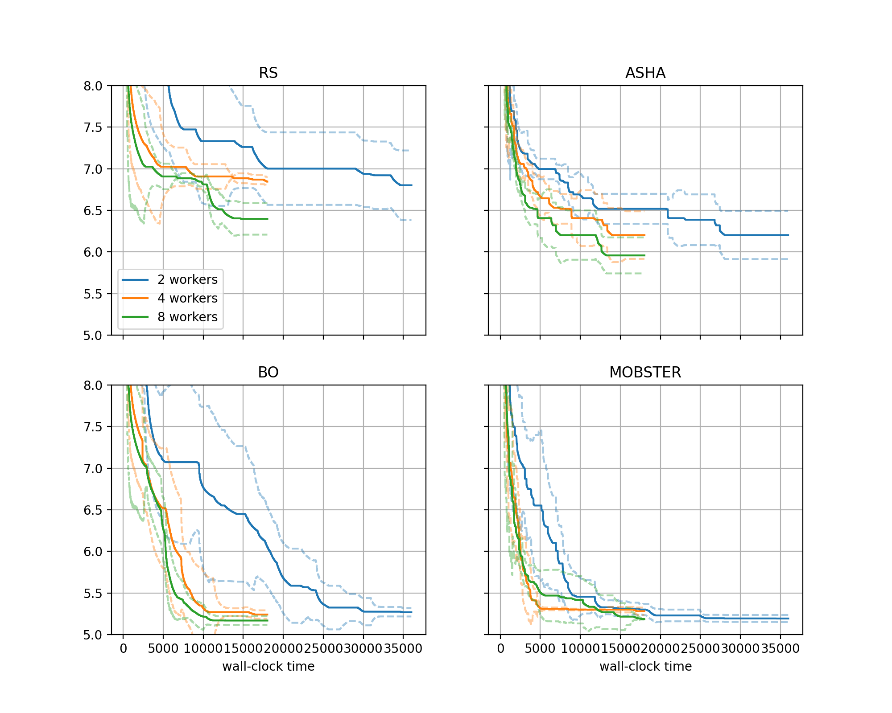

Distributed Tuning
==================

The second approach to shorten the time to the next decision is to decrease
the *time per experiment*. This can be done, to some extent, by increasing the
number of workers, i.e. the number of trials which are run in parallel. In
this section, we show how this can be done.

.. note::
   Imports in our scripts are absolute against the root package
   ``transformer_wikitext2``, so that only the code in
   :mod:`benchmarking.nursery.odsc_tutorial` has to be present. In order to run
   them, you need to append ``<abspath>/odsc_tutorial/`` to the ``PYTHONPATH``
   environment variable. This is required even if you have installed Syne Tune
   from source.

Comparing Different Numbers of Workers
--------------------------------------

Our `study above <comparison.html#a-comparative-study>`__ was done with 4
workers. With the local backend, an experiment with all its workers runs on a
single instance. We need to select an instance type with at least 4 GPUs, and
each training script can use one of them only.

Syne Tune provides another backend,
:class:`~syne_tune.backend.SageMakerBackend`, which executes each trial as a
separate SageMaker training job. This allows you to decouple the number of
workers from the instance type. In fact, for this backend, the default
instance type for our benchmark is ``ml.g4dn.xlarge``, which has a single
GPU and is cheaper to run than ``ml.g4dn.12xlarge`` we used with the
local backend above.

In order to showcase the SageMaker backend, we run a second study in order
to compare our 4 methods ``RS``, ``BO``, ``ASHA``, and ``MOBSTER`` using
a variable number of workers (2, 4, 8). Here, ``max_wallclock_time`` is 5
hours for 4, 8 workers, but double that (10 hours) for 2 workers. Using the
SageMaker backend instead of the local one only requires a minimal change
in the launcher scripts:

.. literalinclude:: ../../../../benchmarking/nursery/odsc_tutorial/transformer_wikitext2/sagemaker/hpo_main.py
   :caption: transformer_wikitext2/sagemaker/hpo_main.py
   :start-after: # permissions and limitations under the License.

.. literalinclude:: ../../../../benchmarking/nursery/odsc_tutorial/transformer_wikitext2/sagemaker/launch_remote.py
   :caption: transformer_wikitext2/sagemaker/launch_remote.py
   :start-after: # permissions and limitations under the License.

We import from ``hpo_main_sagemaker`` and ``launch_remote_sagemaker`` instead
of ``hpo_main_local`` and ``launch_remote_local``. Here is how the experiments
are launched (replace ``...`` by the absolute path to ``odsc_tutorial``):

.. code-block:: bash

   export PYTHONPATH="${PYTHONPATH}:/.../odsc_tutorial/"
   python benchmarking/nursery/odsc_tutorial/transformer_wikitext2/sagemaker/launch_remote.py \
     --experiment_tag tmlr-10 --benchmark transformer_wikitext2 \
     --random_seed 2938702734 --scale_max_wallclock_time 1 \
     --num_seeds 5 --n_workers <n-workers>

Here, ``<n_workers>`` is 2, 4, 8 respectively.

* We run 5 random repetitions (seeds), therefore 20 experiments per value of
  ``<n_workers>``.
* Running the experiments for ``<n_workers>`` requires a resource limit larger
  or equal to ``<n_workers> * 20`` for instance type ``ml.g4dn.xlarge``. If
  your limit is less than this, you should launch fewer experiments in
  parallel, since otherwise most of the experiments will not be able to use
  ``<n_workers>`` workers.
* With ``--scale_max_wallclock_time 1``, we adjust ``max_wallclock_time`` if
  ``n_workers`` is smaller than the default value (4) for our benchmark. In
  our example, the case ``--n_workers 2`` runs for 10 hours instead of 5.

Once all experiments are finished, with results written to S3, we can create
a plot comparing the performance across different numbers of workers, using
the following script:

.. literalinclude:: ../../../../benchmarking/nursery/odsc_tutorial/transformer_wikitext2/sagemaker/plot_results.py
   :caption: transformer_wikitext2/sagemaker/plot_results.py
   :start-after: # permissions and limitations under the License.

For details about visualization of results in Syne Tune, please consider
`this tutorial <../visualization/README.html>`__. In a nutshell:

* Different to the plot above, we have four subplots here, one for each method.
  In each subplot, we compare results for different numbers of workers.
* ``metadata_to_subplot`` configures grouping w.r.t. subplot (depends on
  method), while ``metadata_to_setup`` configures grouping w.r.t. each curve
  shown in each subplot (depends on ``n_workers``).

Here is the plot:

+-----------------------------------------------------------+
| |SageMaker transformer_wikitext2|                         |
+===========================================================+
| Comparison of methods on transformer_wikitext2 benchmark, |
| using the SageMaker backend with 2, 4, 8 workers.         |
+-----------------------------------------------------------+

* In general, we obtain good results faster with more workers. However,
  especially for ``BO`` and ``MOBSTER``, the improvements are less pronounced
  than one might expect.
* Our results counter a common misconception, that as we go to higher degrees of
  parallelization of trials, the internals of the HPO method do not matter
  anymore, and one might as well use random search. This is certainly not the
  case for our problem, where ``BO`` with 2 workers attains a better
  performance after 5 hours than ``RS`` with 8 workers, at a quarter of the
  cost.
