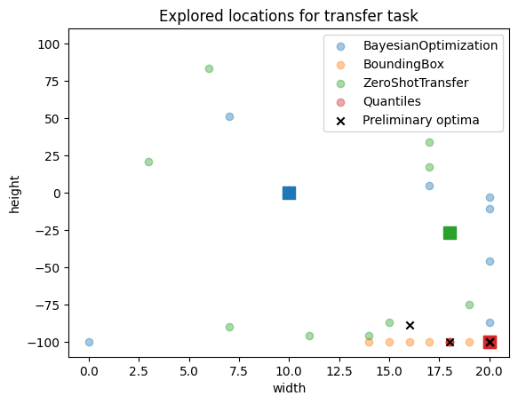

Using Syne Tune for transfer learning
======================================

Syne Tune can be used to perform transfer learning. In this tutorial we look at three transfer learning schedulers: `ZeroShotTransfer`, `BoundingBox` and `Quantiles`. We compare them to standard `BayesianOptimization`. We construct a set of tasks based on the height example. We first collect evaluations of five tasks, and then compare results on the sixth. We consider the single-fidelity case.

In order to run our transfer learning schedulers we need to parse the output of the tuner into a dict of `TransferLearningTaskEvaluations`. We do this in the `extract_transferable_evaluations` function.

.. literalinclude:: transfer_learning_example.py
   :caption: transfer_learning_example.py
   :lines: 60-76

We start by collecting evaluations by running `BayesianOptimization` on five tasks. We generate the different tasks by setting `max_steps=1..5` in the backend in `init_scheduler`. Once we have run BO on the task we store the evaluations as `TransferLearningTaskEvaluations`. 

.. literalinclude:: transfer_learning_example.py
   :caption: transfer_learning_example.py
   :lines: 79-164

Then we run different schedulers to compare on our transfer task with `max_steps=6`.

.. literalinclude:: transfer_learning_example.py
   :caption: transfer_learning_example.py
   :lines: 166-181

We plot the results on the transfer task. We see that the early performance of the transfer schedulers is much better than standard BO.

.. literalinclude:: transfer_learning_example.py
   :caption: transfer_learning_example.py
   :lines: 27-57
   
.. literalinclude:: transfer_learning_example.py
   :caption: transfer_learning_example.py
   :lines: 183-196
   
.. image:: Transfer_task.png
   :width: 768 px

We also look at the parts of the search space explored. First by looking at the preliminary tasks.

.. literalinclude:: transfer_learning_example.py
   :caption: transfer_learning_example.py
   :lines: 198-212
   
.. image:: Configs_explored_preliminary.png
   :width: 768 px

Then we look at the explored search space for the transfer task. For all the transfer methods the first tested point is closer to the previously explored optima, than for BO which starts by checking the middle of the search space.

.. literalinclude:: transfer_learning_example.py
   :caption: transfer_learning_example.py
   :lines: 214-
   

