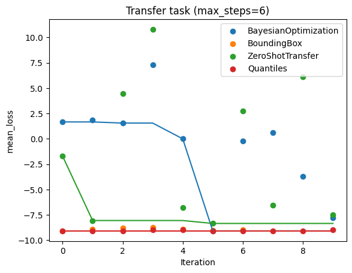
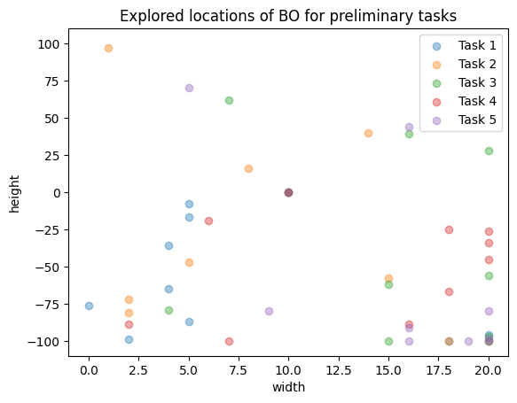

Using Syne Tune for Transfer Learning
=====================================

Transfer learning allows us to speed up our current optimisation by learning
from related optimisation runs. For instance, imagine we want to change from a
smaller to a larger model. We already have a collection of hyperparameter
evaluations for the smaller model. Then we can use these to guide our
hyperparameter optimisation of the larger model, for instance by starting with
the configuration that performed best.
Or imagine that we keep the same model, but add more training data or add
another data feature. Then we expect good hyperparameter configurations on the
previous training data to work well on the augmented data set as well.

Syne Tune includes implementations of several transfer learning schedulers; a
list of available schedulers is given
`here <../../getting_started.html#supported-hpo-methods>`__. In this tutorial we
look at three of them:

* :class:`~syne_tune.optimizer.baselines.ZeroShotTransfer`
    | *Sequential Model-Free Hyperparameter Tuning.*
    | *Martin Wistuba, Nicolas Schilling, Lars Schmidt-Thieme.*
    | *IEEE International Conference on Data Mining (ICDM) 2015.*
    |
    | First we calculate the rank of each hyperparameter configuration on each previous task. Then we choose configurations in order to minimise the sum of the ranks across the previous tasks. The idea is to speed up optimisation by picking configurations with high ranks on previous tasks.
* :class:`~syne_tune.optimizer.schedulers.transfer_learning.BoundingBox`
    | *Learning search spaces for Bayesian optimization: Another view of hyperparameter transfer learning.*
    | *Valerio Perrone, Huibin Shen, Matthias Seeger, Cédric Archambeau, Rodolphe Jenatton.*
    | *NeurIPS 2019.*
    |
    | We construct a smaller hyperparameter search space by taking the minimum box which contains the optimal configurations for the previous tasks. The idea is to speed up optimisation by not searching areas which have been suboptimal for all previous tasks.
* Quantiles (:class:`~syne_tune.optimizer.schedulers.transfer_learning.quantile_based.quantile_based_searcher`)
    | *A Quantile-based Approach for Hyperparameter Transfer Learning.*
    | *David Salinas, Huibin Shen, Valerio Perrone.*
    | *ICML 2020.*
    |
    | We map the hyperparameter evaluations to quantiles for each task. Then we learn a distribution of quantiles given hyperparameters. Finally, we sample from the distribution and evaluate the best sample. The idea is to speed up optimisation by searching areas with high-ranking configurations but without enforcing hard limits on the search space.

We compare them to standard
:class:`~syne_tune.optimizer.baselines.BayesianOptimization` (BO).

We construct a set of tasks based on the
:ref:`height example <train_height_script>`. We first collect
evaluations on five tasks, and then compare results on the sixth. We consider
the single-fidelity case. For each task we assume a budget of 10 (`max_trials`)
evaluations.
We use BO on the preliminary tasks, and for the transfer task we compare BO,
ZeroShot, BoundingBox and Quantiles. The set of tasks is made by adjusting the
`max_steps` parameter in the height example, but could correspond to adjusting
the training data instead.

The code is available
`here <../../examples.html#transfer-learning-example>`__.
Make sure to run it as
`python launch_transfer_learning_example.py --generate_plots`
if you want to generate the plots locally.
The optimisations vary between runs, so your plots might look
different.

In order to run our transfer learning schedulers we need to parse the output of
the tuner into a dict of
:class:`~syne_tune.optimizer.schedulers.transfer_learning.TransferLearningTaskEvaluations`.
We do this in the `extract_transferable_evaluations` function.

.. literalinclude:: ../../../../examples/launch_transfer_learning_example.py
   :caption: Code to prepare evaluations from previous tasks for transfer learning.
   :start-at: def filter_completed(
   :end-before: def run_scheduler_on_task(

We start by collecting evaluations by running `BayesianOptimization` on
the five preliminary
tasks. We generate the different tasks by setting `max_steps=1..5` in the
backend in `init_scheduler`, giving five very similar tasks.
Once we have run BO on the task we store the
evaluations as `TransferLearningTaskEvaluations`.

.. literalinclude:: ../../../../examples/launch_transfer_learning_example.py
   :caption: Code to initialise schedulers, use it to optimise a task and collect evaluations on preliminary tasks.
   :start-at: def run_scheduler_on_task(
   :end-before: # Collect evaluations on transfer task

Then we run different schedulers to compare on our transfer task with
`max_steps=6`. For `ZeroShotTransfer` we set `use_surrogates=True`, meaning
that it uses an XGBoost model to estimate the rank of configurations, as we do
not have evaluations of the same configurations on all previous tasks.

.. literalinclude:: ../../../../examples/launch_transfer_learning_example.py
   :caption: Code to run schedulers on transfer task.
   :start-at: # Collect evaluations on transfer task
   :end-before: # Optionally generate plots.

We plot the results on the transfer task. We see that the early performance of
the transfer schedulers is much better than standard BO. We only plot the first
`max_trials` results. The transfer task is very similar to the preliminary
tasks, so we expect the transfer schedulers to do well. And that is what we see
in the plot below.

.. literalinclude:: ../../../../examples/launch_transfer_learning_example.py
   :caption: Plotting helper code.
   :start-at: def add_labels(
   :end-before: def filter_completed(

.. literalinclude:: ../../../../examples/launch_transfer_learning_example.py
   :caption: Code to plot results on transfer task.
   :start-at: # Optionally generate plots
   :end-at: plt.savefig("Transfer_task.png"

We also look at the parts of the search space explored. First by looking at the
preliminary tasks.

.. literalinclude:: ../../../../examples/launch_transfer_learning_example.py
   :caption: Code to plot the configurations tried for the preliminary tasks.
   :start-at: """ Plot the configs tried for the preliminary tasks """
   :end-at: plt.savefig("Configs_explored_preliminary.png"

Then we look at the explored search space for the transfer task. For all the
transfer methods the first tested point (marked as a square) is closer to the
previously explored optima (in black crosses), than for BO which starts by
checking the middle of the search space.

.. literalinclude:: ../../../../examples/launch_transfer_learning_example.py
   :caption: Code to plot the configurations tried for the transfer task.
   :start-at: """ Plot the configs tried for the transfer task """

.. image:: Configs_explored_transfer.png
   :width: 768 px
