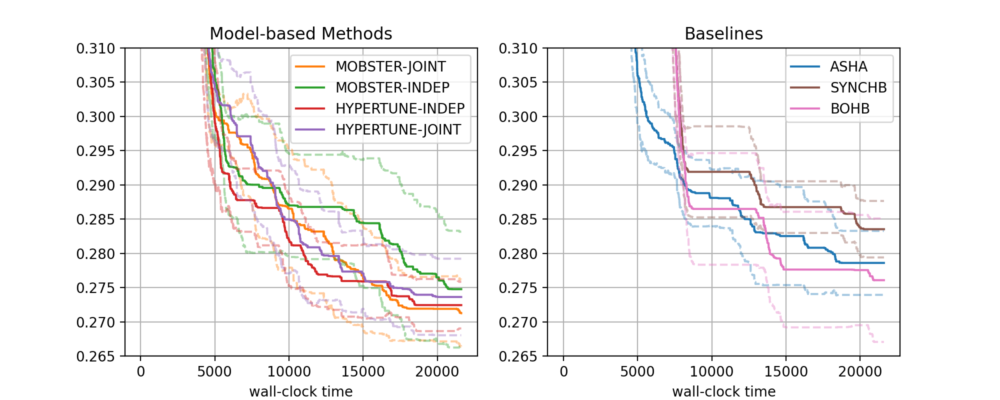

Visualization of Results from many Experiments
==============================================

Apart from troubleshooting, visualizing the results of a single experiment is
of limited use. In this section, we show how to create comparative plots,
using results of many experiment. We will use results from the study
`detailed above <single_experiment.html#a-comparative-study>`__.

A First Comparative Plot
------------------------

Here is the code for generating result plots for two of the benchmarks:

.. literalinclude:: ../../../../benchmarking/examples/benchmark_hypertune/plot_results.py
   :caption: benchmarking/examples/benchmark_hypertune/plot_results.py
   :start-after: # permissions and limitations under the License.

The figure for benchmark ``nas201-cifar-100`` looks as follows:

+---------------------------------------+
| |Results for nas201-cifar-100|        |
+=======================================+
| Results for NASBench-201 (CIFAR-100)  |
+---------------------------------------+

* There are two subfigures next to each other. Each contains a number of
  curves in bold, along with confidence intervals. The horizontal axis
  depicts wall-clock time, and on the vertical axis, we show the best
  metric value found until this time.
* More general, the data from our 1260 experiments can be grouped w.r.t.
  subplot, then *setup*. Each setup gives rise to one curve (bold, with
  confidence band). Subplots are optional, the default is to plot a single
  figure.
* The function ``metadata_to_setup`` maps the metadata stored for an experiment
  to the setup name, or to ``None`` if this experiment should be filtered out.
  In our basic case, the setup is simply the name of the tuning algorithm.
  Our experimentation framework stores a host of information as metadata, the
  most useful keys for grouping are:

  * ``algorithm``: Name of method (``ASHA``, ``MOBSTER-INDEP``, ... in our example)
  * ``tag``: Experiment tag. This is ``docs-1`` in our example. Becomes useful when
    we merge data from different studies in a single figure
  * ``benchmark``: Benchmark name (``nas201-cifar-100``, ... in our example)
  * ``n_workers``: Number of workers

  Other keys may be specific to ``algorithm``.
* Once the data is grouped w.r.t. benchmark, then subplot (optional), then
  setup, we should be left with 15 experiments, one for each seed. Each seed
  gives rise to a best metric value curve. A metric value ``metric_val`` is
  converted as :code:`metric_multiplier * metric_val` if ``mode == "min"``,
  and as :code:`1 - metric_multiplier * metric_val` if ``mode == "max"``.
  For example, if your metric is accuracy in percent (from 0 to 100), then
  ``mode="max"`` and ``metric_multiplier=0.01``, and the curve shows error
  in [0, 1].
* These 15 curves are now interpolated to a common grid, and at each grid
  point, the 15 values (one for each seed) are aggregated into 3 values
  ``lower``, ``aggregate``, ``upper``. In the figure, ``aggregate`` is shown
  in bold, and ``lower``, ``upper`` in dashed. Different aggregation modes
  are supported (selected by ``plot_params.aggregate_mode``):

  * ``mean_and_ci``: Mean and 0.95 normal confidence interval
  * ``iqm_bootstrap`` (default): Interquartile mean and 0.95 confidence
    interval based on the bootstrap variance estimate. These statistics are
    argued for in `Agarwal et.al: Deep Reinforcement Learning at the Edge
    of the Statistical Precipice <https://arxiv.org/abs/2108.13264>`__.
  * ``median_percentiles``: Median and 25 (lower), 75 (upper) percentiles

* Plotting starts with the creation of a
  :class:`~syne_tune.experiments.ComparativeResults` object. We need to
  pass the experiment names (or tags), the list of all setups, the number of
  runs (or seeds), the ``metadata_to_setup`` function, as well as default
  plot parameters in ``plot_params``. See
  :class:`~syne_tune.experiments.PlotParameters` for full details about the
  latter. In our example, we set ``xlabel``, ``aggregate_mode`` (see above),
  and enable a grid with ``grid=True``. Note that these parameters can be
  extended and overwritten by parameters for each plot.
* In our example, we separate the MOBSTER and HYPERTUNE setups from the
  baselines, by using two subfigures. This is done by specifying
  ``plot_params.subplots`` and ``metadata_to_subplot``. In the former,
  ``plot_params.subplots.nrows`` and ``plot_params.subplots.ncols `` are
  mandatory, prescribing the shape of the subplot arrangement.
  In ``plot_params.subplots.titles``, we can provide titles for each column
  (which we do here). If given, this overrides ``plot_params.title``.
  Also, ``plot_params.subplots.legend_no=[0, 1]`` asks for legends in both
  subplots (the default is no legend at all). For full details about these
  arguments, see :class:`~syne_tune.experiments.SubplotParameters`
* The creation of ``results`` does a number of things. First, if
  ``download_from_s3=True``, result files are downloaded from S3. In our
  example, we assume this has already been done. Next, all result files are
  iterated over, all ``metadata.json`` are read, and an inverse index from
  benchmark name to paths, ``setup_name``, and ``subplot_no`` is created.
  This process also checks that exactly ``num_runs`` experiments are present
  for every setup. For large studies, it frequently happens that too few
  or too many results are found. The warning outputs can be used for
  debugging.
* Given ``results``, we can create plots for every benchmark. In our example,
  this is done for ``nas201-cifar100`` and ``nas201-ImageNet16-120``, by
  calling ``results.plot()``. Apart from the benchmark name, we also pass
  plot parameters in ``plot_params``, which extend (and overwrite) those
  passed at construction. In particular, we need to pass ``metric`` and
  ``mode``, which we can obtain from the benchmark description. Moreover,
  ``ylim`` is a sensible range for the vertical axis, which is different
  for every benchmark (this is optional).
* If we pass ``file_name`` as argument to ``results.plot``, the figure is
  stored in this file.
* ``results.plot`` returns a dictionary, whose entries "fig" and "axs" contain
  the figure and its axes (subfigures), allowing for further fine-tuning.

.. note::
   If suplots are used, the grouping is w.r.t. ``(subplot, setup)``, not
   just by ``setup``. This means you can use the same setup name in
   different subplots to show different data. For example, your study may
   have run a range of methods under different conditions (say, using a
   different number of workers). You can then map these conditions to
   subplots and show the *same* setups in each subplot. In any case, the
   mapping of setups to colors is fixed and the same in every subplot.

.. note::
   Plotting features presented here can also be used to visualize results
   for a single seed. In this case, there are no error bars.

Additional Features
-------------------

In this section, we discuss additional features, allowing you to customize
your result plots.

Combining Results from Multiple Studies
~~~~~~~~~~~~~~~~~~~~~~~~~~~~~~~~~~~~~~~

HPO experiments are expensive to do, so you want to avoid re-running them
for baselines over and over. Our plotting tools allow you to easily combine
results across multiple studies.

As an example, say we would like to relate our ``docs-1`` results to what
random search and Bayesian optimization do on the same benchmarks. These
baseline results were already obtained as part of an earlier study
``baselines-1``, in which a number of methods were compared, among them ``RS``
and ``BO``. As an additional complication, the earlier study used 30
repetitions (or seeds), while ``docs-1`` uses 15. Here is the modification of
the code above in order to include these additional baseline results in the
plot on the right side. First, we need to replace ``metadata_to_setup`` and
``SETUPS_RIGHT``:

.. code-block:: python

   def metadata_to_setup(metadata: Dict[str, Any]) -> Optional[str]:
       algorithm = metadata["algorithm"]
       tag = metadata["tag"]
       seed = int(metadata["seed"])
       # Filter out experiments from "baselines-1" we don't want to compare
       # against
       if tag == "baselines-1" and (seed >= 15 or algorithm not in ("RS", "BO")):
           return None
       else:
           return algorithm

   SETUPS_RIGHT = ("ASHA", "SYNCHB", "BOHB", "RS", "BO")

There are now two more setups, "RS" and "BO", whose results come from the
earlier ``baselines-1`` study. Now, ``ComparativeResults`` has to be created
differently:

.. code-block:: python

   experiment_names = experiment_names + ("baselines-1",)
   setups = setups + ["RS", "BO"]
   results = ComparativeResults(
       experiment_names=experiment_names,
       setups=setups,
       num_runs=num_runs,
       metadata_to_setup=metadata_to_setup,
       plot_params=plot_params,
       metadata_to_subplot=metadata_to_subplot,
       download_from_s3=download_from_s3,
   )

.. note::
   If you intend to combine results from several different studies, it is
   recommended to use the same random seed (specified as ``--random_seed``),
   which ensures that the same sequence of random numbers is used in each
   experiment. This results in a so-called *paired comparison*, lowering the
   random variations across setups. In our example, we would look up the
   master random seed of the ``baselines-1`` study and use this for ``docs-1``
   as well.

Add Performance of Initial Trials
~~~~~~~~~~~~~~~~~~~~~~~~~~~~~~~~~

When using HPO, you often have an idea about one or several default
configurations that should be tried first. In Syne Tune, such initial
configurations can be specified by ``points_to_evaluate`` (see
`here <../basics/basics_randomsearch.html#recommendations>`__ for details).
An obvious question to ask is how long it takes for a HPO method to find a
configuration which works significantly better than these initial ones.

We can visualize the performance of initial trials by specifying
``plot_params.show_init_trials`` of type
:class:`~syne_tune.experiments.ShowTrialParameters`. In our ``docs-1`` study,
``points_to_evaluate`` is not explicitly used, but the configuration of the
first trial is selected by a mid-point heuristic. Our plotting script from
above needs to be modified:

.. code-block:: python

   plot_params.show_init_trials = ShowTrialParameters(
       setup_name="ASHA",
       trial_id=0,
       new_setup_name="default"
   )
   results = ComparativeResults(
       experiment_names=experiment_names,
       setups=setups,
       num_runs=num_runs,
       metadata_to_setup=metadata_to_setup,
       plot_params=plot_params,
       metadata_to_subplot=metadata_to_subplot,
       download_from_s3=download_from_s3,
   )

Since the ``ASHA`` curve is plotted on the right side, this will add another
curve there with label ``default``. This curve shows the best metric value,
using data from the first trial only (``trial_id == 0``). It is extended as a
flat constant line to the end of the horizontal range.

If you specify a number of initial configurations with ``points_to_evaluate``,
set ``ShowTrialParameters.trial_id`` to their number minus 1. The initial trials
curve will use data from trials with ID less or equal this number.

Controlling Subplots
~~~~~~~~~~~~~~~~~~~~

Our example above already creates two subplots, horizontally arranged, and we
discussed the role of ``metadata_to_subplot``. Here, we provide extra details
about fields in :class:`~syne_tune.experiments.SubplotParameters`, the type
for ``plot_params.subplots``:

* ``nrows``, ``ncols``: Shape of subplot matrix. The total number of subplots
  is ``<= ncols * nrows``. ``kwargs`` contains further arguments to
  ``matplotlib.pyplot.subplots``. For example, if ``sharey="all"``, the y tick
  labels are only created for the first column. If you use ``nrows > 1``,
  you may want to share x tick labels as well, with ``sharex="all"``.
* ``titles``: If ``title_each_figure == False``, this is a list of titles,
  one for each column. If ``title_each_figure == True``, then ``titles``
  contains a title for each subplot. If ``titles`` is not given, the
  global title ``plot_params.title`` is printed on top of the left-most
  column.
* ``legend_no``: List of subfigures in which the legend is shown. The default
  is not to show legends. In our example, there are different setups in each
  subplot, so we want a legend in each. If your subplots show the same setups
  under different conditions, you may want to show the legend in one of the
  subplots only, in which case ``legend_no`` contains a single number.
* ``xlims``: Use this if your subfigures have x axis ranges. The global
  ``xlim`` is overwritten by ``(0, xlims[subplot_no])``.
* ``subplot_indices``: Any given plot produced by
  :meth:`~syne_tune.experiments.ComparativeResults.plot` does not have to
  contain all subfigures. For example, you may want to group your results
  into 4 or 8 bins, then create a sequence of plots comparing pairs of them.
  If ``subplot_indices`` is given, it contains the subplot indices to be shown,
  and this order. Otherwise, this is :math:`0, 1, 2, \dots`. If this is given,
  then ``titles`` and ``xlims`` is relative to this list (in that
  ``xlims[i]`` corresponds to subfigure ``subplot_indices[i]``), but
  ``legend_no`` is not.

Plotting Derived Metrics
~~~~~~~~~~~~~~~~~~~~~~~~

You can also plot metrics which are not directly contained in the results data
(as a column), but which can be computed from the results. To this end, you
can pass a dataframe column generator as ``dataframe_column_generator`` to
:meth:`~syne_tune.experiments.ComparativeResults.plot`. For example, assume
we run multi-objective HPO methods on a benchmark involving metrics ``cost``
and ``latency`` (``mode="min"`` for both of them). The final ``plot`` command
would look like this:

.. code-block:: python

   from syne_tune.experiments.multiobjective import (
       hypervolume_indicator_column_generator,
   )

   # ...

   dataframe_column_generator = hypervolume_indicator_column_generator(
       metrics_and_modes = [("cost", "min"), ("latency", "min")]
   )
   plot_params = PlotParameters(
       metric="hypervolume_indicator",
       mode="max",
   )
   results.plot(
       benchmark_name=benchmark_name,
       plot_params=plot_params,
       dataframe_column_generator=dataframe_column_generator,
       one_result_per_trial=True,
   )

* The mapping returned by
  :func:`~syne_tune.experiments.multiobjective.hypervolume_indicator_column_generator`
  maps a results dataframe to a new column containing the best hypervolume
  indicator as function of wall-clock time for the metrics ``cost`` and
  ``latency``, which must be contained in the results dataframe.
* The option ``one_result_per_trial=True`` of ``results.plot`` ensures that the
  result data is filtered, so that for each experiment, one the final row for
  each trial remains. This option is useful if the methods are single-fidelity,
  but results are reported after each epoch. The filtering makes sure that only
  results for the largest epoch are used for each trial. Since this is done
  before the best hypervolume indicator is computed, it can speed up the
  computation dramatically.

Filtering Experiments by DateTime Bounds
~~~~~~~~~~~~~~~~~~~~~~~~~~~~~~~~~~~~~~~~

Results can be filtered out by having ``metadata_to_setup`` or
``metadata_to_subplot`` return ``None``. This is particularly useful if results
from several studies are to be combined. Another way to filter experiments is
using the ``datetime_bounds`` argument of
:class:`~syne_tune.experiments.ComparativeResults`. A common use case is that
experiments for a large study have been launched in several stages, and those
of an early stage failed. If the corresponding result files are not removed on S3,
the creation of ``ComparativeResults`` will complain about too many results
being found. ``datetime_bounds`` is specified in terms of date-time strings of
the format :const:`~syne_tune.constants.ST_DATETIME_FORMAT`, which currently is
"YYYY-MM-DD-HH-MM-SS". For example, if results are valid from
"2023-03-19-22-01-57" onwards, but invalid before, we can use
``datetime_bounds=("2023-03-19-22-01-57", None)``. ``datetime_bounds`` can also
be a dictionary with keys from ``experiment_names``, in which case bounds are
specific to different experiment prefixes.

Extract Meta-Data Values
~~~~~~~~~~~~~~~~~~~~~~~~

Apart from plotting results, we can also retrieve meta-data values. This is
done by passing a list of meta-data key names via ``metadata_keys`` when
creating :class:`~syne_tune.experiments.ComparativeResults`. Afterwards, the
corresponding meta-data values can be queried by calling
``results.metadata_values(benchmark_name)``. The result is a nested dictionary
``result``, so that ``result[key][setup_name]`` is a list of values, where
``key`` is the meta-data key from ``metadata_keys``, ``setup_name`` is a setup
name. The list contains values from all experiments mapped to this
``setup_name``. If you use the same setup names across different subplots,
set ``metadata_subplot_level=True``, in which case
``results.metadata_values(benchmark_name)`` returns
``result[key][setup_name][subplot_no]``, so the grouping w.r.t. setup names
*and* subplots is used.

Extract Final Values for Extra Results
~~~~~~~~~~~~~~~~~~~~~~~~~~~~~~~~~~~~~~

Syne Tune allows extra results to be stored alongside the usual metrics data,
as shown in
`examples/launch_height_extra_results.py <../../examples.html#customize-results-written-during-an-experiment>`__.
These are simply additional columns in the result dataframe. In order to plot
them over time, you currently need to write your own plotting scripts. If the
best value over time approach of Syne Tune's plotting tools makes sense for
any single column, you can just specify their name for ``plot_params.metric``
and set ``plot_params.mode`` accordingly.

However, in many cases it is sufficient to know final values for extra results,
grouped in the same way as everything else. For example, extra results may be
used to monitor some internals of the HPO method being used, in which case we
may be satisfied to see these statistics at the end of experiments. If
``extra_results_keys`` is used in
:meth:`~syne_tune.experiments.ComparativeResults.plot`, the method returns
a nested dictionary ``extra_results`` under key "extra_results", so that
``extra_results[setup_name][key]`` contains a list of values (one for each
seed) for setup ``setup_name`` and ``key`` an extra result name from
``extra_results_keys``. As `above <#extract-meta-data-values>`__, if
``metadata_subplot_level=True`` at construction of
:class:`~syne_tune.experiments.ComparativeResults`, the structure of the
dictionary is ``extra_results[setup_name][subplot_no][key]``.
