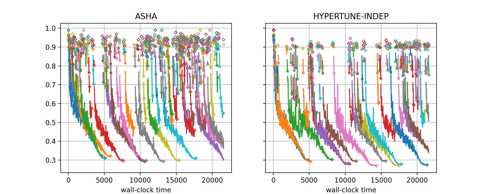

Visualizing Learning Curves
===========================

We have seen how results from many experiments can be visualized jointly in
order to compare different HPO methods, different variations of the benchmark
(e.g., different configuration spaces), or both. In order to understand
differences between two setups in a more fine-grained fashion, it can be useful
to look at learning curve plots. In this section, we demonstrate Syne Tune
tooling along this direction.

Why Hyper-Tune Does Outperform ASHA?
------------------------------------

In our ``docs-1`` study, ``HYPERTUNE-INDEP`` significantly outperforms ``ASHA``.
The best metric value curve descends much faster initially, and also the final
performance at ``max_wallclock_time`` is significantly better.

How can this difference be explained? Both methods use the same scheduling logic,
so differences are mostly due to how configurations of new trials are suggested.
In ``ASHA``, this is done by random sampling. In ``HYPERTUNE-INDEP``, independent
Gaussian process surrogate models are fitted on observations at each rung level,
and decisions are made based on an acquisition function which carefully weights
the input from each of these models (details are given
`here <../multifidelity/mf_async_model.html#hyper-tune>`__). But how exactly does
this difference matter? We can find out by plotting learning curves of trials
for two experiments next to each other, ``ASHA`` on the left, `HYPERTUNE-INDEP``
on the right. Here is the code for doing this:

Here is the code for generating result plots for two of the benchmarks:

.. literalinclude:: code/plot_learning_curves.py
   :caption: code/plot_learning_curves.py
   :start-after: # permissions and limitations under the License.

The figure for benchmark ``nas201-cifar-100`` and ``seed=7`` looks as follows:

+-----------------------------------------------------------+
| |Learning curves for nas201-cifar-100|                    |
+===========================================================+
| Learning curves for NASBench-201 (CIFAR-100), ``seed=7``  |
+-----------------------------------------------------------+

The class for creating learning curve plots is
:class:`~syne_tune.experiments.TrialsOfExperimentResults`. It is quite similar
to :class:`~syne_tune.experiments.ComparativeResults`, but there are differences:

* For learning curve plots, each setup occupies its own subfigure. Also, the seed
  for each plot is fixed, so each subfigure is based on the results for a single
  experiment.
* ``metadata_to_setup`` is used to filter out the experiments we want to compare.
  In this case, this is ``ASHA`` and ``HYPERTUNE-INDEP``.
* The default for ``plot_params.subplots`` is a single row of subfigures, one for
  each setup, and titles correspond to setup names. In our example, we use this
  default. If you want to compare many setups, you can use an arrangement with
  multiple rows as well.
* In learning curve plots, the trajectory of metric values for a trial is
  plotted in a different color per trial (more precisely, we circle through a
  palette, so that eventually colors are repeated). The final metric value of
  a trial is marked with a diamond.
* If comparing multi-fidelity methods (like ASHA, Hyper-Tune, MOBSTER), you
  should also specify ``multi_fidelity_params``, passing the rung levels. In
  this case, metric values at rung levels are marked by a circle, or by a
  diamond if this is the final value for a trial.
* If some of your multi-fidelity setups are of the pause-and-resume type
  (i.e., the evaluation of a trial can be paused and possibly resumed later
  on), list them in ``multi_fidelity_params.pause_resume_setups``. Trajectories
  of pause-and-resume methods need to be plotted differently: there has to be
  a gap between the value at a rung level and the next one, instead of a line
  connecting them. In our example, all setups are pause-and-resume, and these
  gaps are clearly visible.

What do these plots tell us about the differences between ``ASHA`` and
``HYPERTUNE-INDEP``? First of all, ``HYPERTUNE-INDEP`` has many less isolated
diamonds than ``ASHA``. These correspond to trials which are paused after one
epoch and never resumed. For ``ASHA``, both the rate of single diamonds and
their metric distribution remains stationary over time, while for
``HYPERTUNE-INDEP``, the rate rapidly diminishes, and also the metric values
for single diamonds improve. This is what we would expect. ``ASHA`` does not
learn anything from the past, and simply continues to suggest configurations
at random, while ``HYPERTUNE-INDEP`` rapidly learns what part of the
configuration to avoid and does not repeat basic mistakes moving forward. This
means that overall, ``ASHA`` wastes resources on starting poorly performing
trials over and over, while ``HYPERTUNE-INDEP`` uses these resources in order
to resume training for more trials, thereby reaching better performances over
the same time horizon. These results were obtained in the context of simulated
experimentation, without delays for starting, pausing, or resuming trials. In
the presence of such delays, the advantage of model-based methods over ``ASHA``
becomes more pronounced.

With specific visualizations, we can drill deeper to figure out what
``HYPERTUNE-INDEP`` learns about the configuration space. For example, the
configurations of all trials are stored in the results as well. Doing so, we
can confirm that ``HYPERTUNE-INDEP`` rapidly learns about basic properties of
the ``NASBench-201`` configuration space, where certain connections are mandatory
for good results, and consistenty chooses them after a short initial phase.
