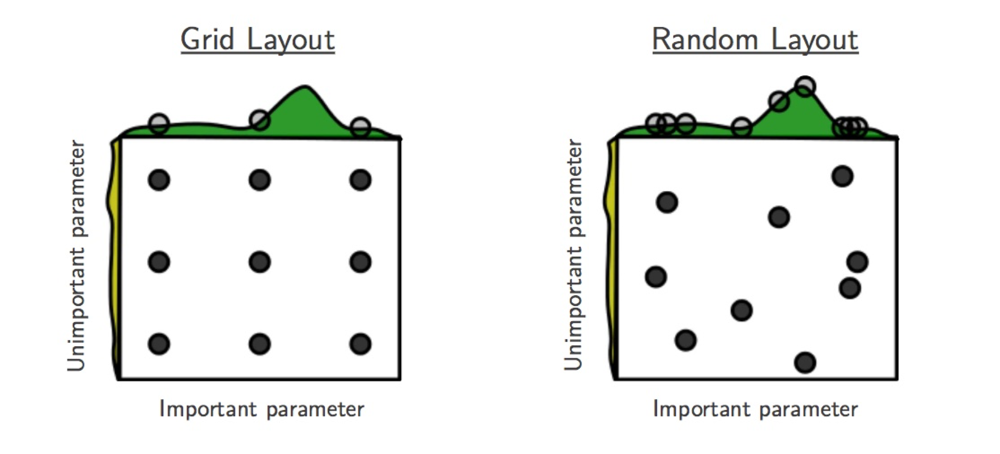
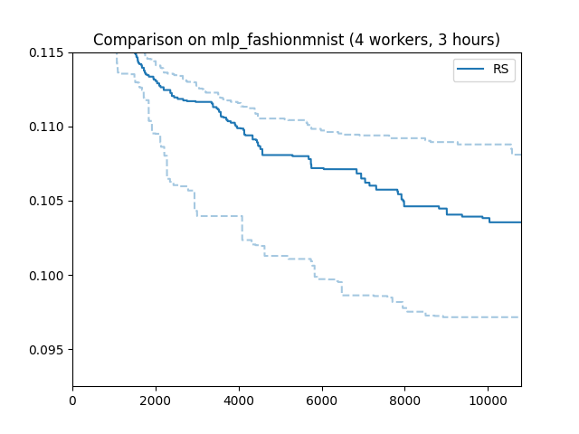

# Basics of Syne Tune: Random Search


[[Previous Section]](basics_setup.md)


## Grid and Random Search

With our tuning problem well-defined, what are basic methods to solve it?
The most frequently used baselines are *grid search* and *random search*. Both
of them pick a sequence of hyperparameter configurations, evaluate the objective
for all of them, and return the configuration which attained the best metric
value. This sequence is chosen independently of any metric values received in
the process, a property which not only renders these baselines very simple to
implement, but also makes them *embarrassingly parallel*.

|  |
| :--- |
| Grid and Random Search (figure by Bergstra & Bengio) |

For *grid search*, we place a grid on each hyperparameter range, which is
uniformly or log-uniformly spaced. The product of these grids determines the
sequence, which can be traversed in regular and random ordering. An obvious
drawback of grid search is that the size of this sequence is exponential
in the number of hyperparameters. Simple "nested loop" implementations are
particularly problematic: if they are stopped early, HPs in outer loops are
sampled much worse than those in inner loops. As seen in the figure above,
grid search is particularly inefficient if some HPs are more important for
the objective values than others.

For all of these reasons, grid search is not a recommended baseline for HPO,
unless very few parameters have to be tuned. It is not currently implemented
in Syne Tune.

In *random search*, the sequence of configurations is chosen by independent
sampling. In the simple case of interest here, each value in a configuration
is chosen by sampling independently from the hyperparameter domain. Recall
our search space:

```python
from syne_tune.config_space import randint, uniform, loguniform

config_space = {
    'n_units_1': randint(4, 1024),
    'n_units_2': randint(4, 1024),
    'batch_size': randint(8, 128),
    'dropout_1': uniform(0, 0.99),
    'dropout_2': uniform(0, 0.99),
    'learning_rate': loguniform(1e-6, 1),
    'weight_decay': loguniform(1e-8, 1),
}
```

Here, `n_units_1` is sampled uniformly from `4,...,1024`, while `learning_rate`
is sampled log-uniformly from `[1e-6, 1]` (i.e. it is `exp(u)`, where `u` is
sampled uniformly in `[-6 log(10), 0]`). As seen in FIGREF, random search in
general does better than grid search when some HPs are more important than
others.


## Launcher Script for Random Search

For our first full-blown HPO experiment, let us run random search. Please have a
look at [launch_randomsearch.py](scripts/launch_randomsearch.py). We have already
studied the first part of this script in the previous section.
* [1] Recall that apart from the 7 hyperparameters, our training script needs
  two additional parameters, which are fixed throughout the experiment. In
  particular, we need to specify the number of epochs to train for in `epochs`.
  We set this value to `max_resource_level = 81`. Here, "resource" is a more
  general concept than "epoch", but for most of this tutorial, they can be
  considered to be the same.
* [2] Next, we need to choose a back-end, which specifies how Syne Tune should
  execute our training jobs (also called *trials*). The simplest choice is the 
  local back-end, which runs trials as sub-processes on a single instance.
  Another more powerful back-end will be considered further below.
* [3] Most important, we need to choose a *scheduler*, which is how HPO
  algorithms are referred to in Syne Tune. A scheduler needs to suggest
  configurations for new trials, and also to make scheduling decisions about
  running trials.
  The simplest scheduler is `FIFOScheduler`, which cannot be used to make
  decisions on whether to stop or pause running trials, or resume trials
  which have been paused -- advanced concepts we will learn about below. It
  needs to know `metric` and `mode` of optimization. If its decisions are
  randomized, `random_seed` controls this random sampling.
* Many schedulers can be configured by *searchers*. A searcher is the part
  of an HPO algorithm responsible for suggesting the next configuration.
  We obtain random search by setting `searcher='random'` in `FIFOScheduler`
  (this is also the default for `searcher`).
* [4] Finally, we need to specify a stopping criterion. In our example,
  we run random search for `max_wallclock_time = 3 * 3600` seconds, or 3
  hours. `StoppingCriterion` can also use other attributes, such as
  `max_num_trials_started` or `max_num_trials_completed`. If several
  attributes are used, you get the *or* combination.
* Everything comes together in the `Tuner`. Here, we can also specify
  `n_workers`, the number of workers. This is the maximum number of trials
  which are run concurrently. For the local back-end, concurrent trials
  share the resources of a single instance (e.g., CPU cores or GPUs), so
  the effective number of workers is limited in this way.
  To ensure you really use `n_workers` workers, make sure to pick an
  instance type which caters for your needs (e.g., no less than `n_workers`
  GPUs), and also make sure your training script does not grab all the
  resources. Finally, `tuner.run()` starts the HPO experiment. It takes a
  while (3 hours)...


## Results for Random Search

|  |
| :--- |
| Results for Random Search |

Here is how random search performs on our running example. The x axis is
wall-clock time, the y axis best validation error attained until then.
Such "tuning curves" are among the best ways to compare different HPO
methods, as they display the most relevant information, without hiding
overheads due to synchronization requirements or decision-making.

We ran random search with 4 workers (`n_workers = 4`) for 3 hours. In fact,
we repeated the experiments 50 times with different random seeds. The solid
line shows the median, the dashed lines the 25 and 75 percentiles. An
important take-away message is that HPO performance can vary substantially
when repeated randomly, especially when the experiment is stopped rather
early. When comparing methods, it is therefore important to run enough
random repeats and use appropriate statistical techniques which acknowledge
the inherent random fluctuations.


## Recommendations

One important parameter of `FIFOScheduler` we did not use is `points_to_evaluate`,
which allows specifying initial configurations to suggest first. For example:

```python
first_config = dict(
    n_units_1=128,
    n_units_2=128,
    batch_size=64,
    dropout_1=0.5,
    dropout_2=0.5,
    learning_rate=1e-3,
    weight_decay=0.01)

scheduler = FIFOScheduler(
    config_space,
    searcher='random',
    mode=mode,
    metric=metric,
    random_seed=random_seed,
    points_to_evaluate=[first_config],
)
```
Here, `first_config` is the first configuration to be suggested, while subsequent
ones are drawn at random. If the model you would like to tune comes with some
recommended defaults, you should use them in `points_to_evaluate`, in order to
give random search a head start. In fact, `points_to_evaluate` can contain more
than one initial configurations, which are then suggested in the order given
there. If you insist on grid search, you could implement it that way!

Note that configurations in `points_to_evaluate` need not be completely specified.
If so, missing values are imputed by a mid-point rule. In fact, the default for
`points_to_evaluate` is `[dict()]`, namely one configuration where all values are
selected by the mid-point rule. If you want to run pure random search from the
start (which is not recommended), you need to set `points_to_evaluate=[]`. Details
are provided [here](../../schedulers.md#fifoscheduler).

In the [next section](basics_bayesopt.md), we will try to improve upon random
search with Bayesian optimization, which makes model-based decisions based on
metric results of earlier trials.
