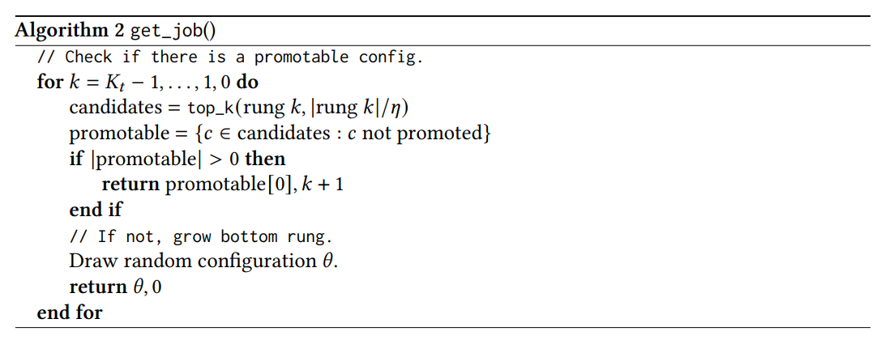

# PASHA: Efficient HPO with Progressive Resource Allocation
Hyperparameter optimization (HPO) and neural architecture search (NAS) are methods of choice to obtain the best-in-class machine learning models, but in practice they can be costly to run. When models are trained on large datasets, tuning them with HPO or NAS rapidly becomes prohibitively expensive for practitioners, even when efficient multi-fidelity methods are employed. We propose an approach to tackle the challenge of tuning machine learning models trained on large datasets with limited computational resources. Our approach, named PASHA, is able to dynamically allocate resources for the tuning procedure depending on the need. The experimental comparison shows that PASHA identifies well-performing hyperparameter configurations and architectures while consuming significantly fewer computational resources than solutions like ASHA.

## What is PASHA?
The goal of PASHA is to identify well-performing configurations significantly faster than current methods, so that we can then retrain the model with the selected configuration (in practice on the combined training and validation sets). By giving preference to evaluating more configurations rather than evaluating them for longer than needed, PASHA can lead to significant speedups while achieving similar performance as existing methods.

PASHA is a variant of ASHA that starts with a small amount of initial resources and gradually increases them depending on the stability of configuration rankings in the top two rungs (rounds of promotion). Each time the ranking of configurations in the top two rungs becomes inconsistent, PASHA increases the maximum number of resources. This can be understood as "unlocking" a new rung level.  An illustration of how PASHA stops early if the ranking of configurations has stabilized is shown in Figure 1, and we summarize PASHA in Algorithm 1 and 2.

Given that deep learning algorithms typically rely on stochastic gradient descent, ranking
inconsistencies can occur between similarly performing configurations. Hence, we need some
benevolence in estimating the ranking. We propose to use a soft-ranking approach where we group configurations based on their validation performance metric (e.g. accuracy).

In soft ranking, configurations are still sorted by predictive performance but they are considered
equivalent if the performance difference is smaller than a fixed value $\epsilon$ (or equal to it). Instead of producing a sorted list of configurations, this provides a list of lists where for every position of the  ranking there is a list of equivalent configurations. The concept is explained graphically in Figure 2. In our experiments we have used soft ranking with fixed $\epsilon=0.025$, which has given consistently strong results.

## Launcher Script

We provide an example script [launch_pasha_nasbench201_demo.py](scripts/launch_pasha_nasbench201_demo.py) that shows how to run experiments with PASHA on NASBench201. We compare PASHA with ASHA (promotion type) and the relevant baselines - one epoch and random.

In the script we also show how we can change the ranking function that PASHA uses. For example, the value of $\epsilon$ in soft ranking can be estimated automatically using the standard deviation of objective values in the previous rung (e.g. $2\sigma$). The script further explains how we can combine PASHA with sample-efficient strategies based on Bayesian Optimization.

## What are the Results?
After running the [launch_pasha_nasbench201_demo.py](scripts/launch_pasha_nasbench201_demo.py) script we obtain the results that we show in Table 1 (subject to changes in Syne Tune after writing the tutorial).
The results suggest that PASHA consistently leads to strong improvements in runtime, while achieving similar accuracies as ASHA. The one epoch baseline has noticeably worse accuracies than ASHA or PASHA, suggesting that PASHA does a good job of deciding when to continue increasing the resources – it does not stop too early. Random baseline is a lot worse than the one epoch baseline, so there is value in performing NAS.

## Recommendations

PASHA is an algorithm that is particularly useful for large-scale datasets with millions of datapoints, where it can lead to e.g. 5x speedup compared to ASHA. Note that for such datasets it is useful to define rung levels in terms of the number of datapoints processed rather than the number of epochs as a small number of epochs may be enough for training the model until convergence.

A suitable stopping criterion for PASHA is the number of configurations that have been evaluated so far, but it can also be evaluated using stopping criteria based on the wallclock time. With time-based criteria PASHA would make an impact when the stopping time is selected as a small value.

Selecting the value of $\epsilon$ for soft ranking requires some amount of domain expertise to judge what values are reasonable. However, we have found $\epsilon=0.025$ (2.5%) to be a good rule-of-thumb in practice. Another criterion that has worked well is $\epsilon=2\sigma$, which has the benefit of automatic selection of $\epsilon$.
